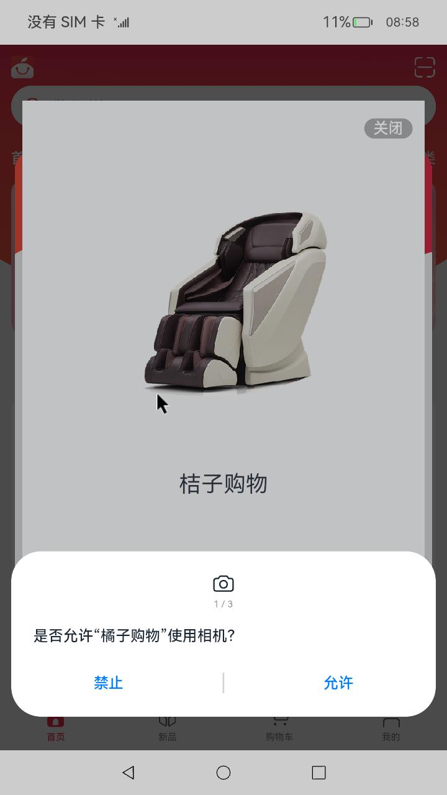

&nbsp;:book: [查看本文案例](https://gitee.com/openharmony/applications_app_samples/tree/master/code/Solutions/Shopping/OrangeShopping)

<p align="center">
  <h1 align="center">OpenHarmony应用访问控制权限申请开发范例</h1>
</p>

<!-- panels:start -->

<!-- div:title-panel -->

## 概念介绍

<!-- div:left-panel -->

在应用首次启动时，我们常常遇到，需要申请授权才能使用应用的完整功能，比如在应用首次启动时，会弹窗申请开启位置权限、申请相机权限等，如图所示。本文就以[橘子购物示例应用](https://gitee.com/openharmony/applications_app_samples/tree/master/code/Solutions/Shopping/OrangeShopping)为例，来讲解OpenHarmony应用首次启动申请授权相关的技术点。

OpenHarmony应用框架提供了200+应用权限，在权限列表文件中，我们可以看到每种权限有不同的APL级别、权限类型、ACL使能信息，如下所示。我们先看下应用权限相关的几个概念。

```
ohos.permission.WRITE_CONTACTS
允许应用添加、移除或更改联系人数据。

权限级别：system_basic

授权方式：user_grant

ACL使能：TRUE
```

- 应用APL等级

元能力权限等级APL（Ability Privilege Level）指的是应用的权限申请优先级的定义，不同APL等级的应用能够申请的权限等级不同。
应用的等级可以分为三个等级，如下表。默认情况下，应用的APL等级都为normal等级。权限列表中的权限级别指的就是APL等级，应用

| APL级别        | 说明                  |
| ------------ | ------------------- |
| system_core  | 该等级的应用服务提供操作系统核心能力。 |
| system_basic | 该等级的应用服务提供系统基础服务。   |
| normal       | 普通应用。               |

- 权限类型

根据授权方式的不同，权限类型可分为system_grant（系统授权）和user_grant（用户授权）。对应权限列表中的授权方式。

- 访问控制列表（ACL）

每个应用权限中的权限级别和应用的APL等级是一一对应的。原则上，拥有低APL等级的应用默认无法申请更高等级的权限。
访问控制列表ACL（Access Control List）提供了解决低等级应用访问高等级权限问题的特殊渠道。

<!-- div:right-panel -->

[橘子购物示例应用](https://gitee.com/openharmony/applications_app_samples/tree/master/code/Solutions/Shopping/OrangeShopping)首次启动申请权限的示例图：

<p align="center">

</p>

<!-- div:title-panel -->

## 配置文件

了解了权限相关的概念，我们看下权限相关的配置文件。

<!-- div:left-panel -->

### module.json5配置文件

应用需要在项目的module.json5配置文件中逐个声明所需的权限，否则应用将无法获取授权。不管是什么授权方式，system_grant（系统授权）还是user_grant（用户授权）都需要在配置文件中声明。

在配置文件的requestPermissions属性数组中配置所需的权限，包含3个属性：name、reason和usedScene。

其中：

- name 指定权限名称，是必填项。
- reason 描述申请权限的原因，可选项。
- usedScene 描述权限使用的场景和时机，可选项。
  - abilities：标识需要使用到该权限的Ability，标签为数组形式。可选项。    
  - when：标识权限使用的时机，值为inuse/always。inuse：表示为仅允许前台使用；always：表示前后台都可使用。

应用默认的权限等级为normal。如果应用需要申请高于默认等级的权限，除了在配置文件中进行声明之外，还需要通过ACL方式进行声明使用。下文会介绍。

<!-- div:right-panel -->

module.json5配置文件片段如下：

```json5
{
  "module" : {
    ...
    "requestPermissions":[
      {
        "name" : "ohos.permission.PERMISSION1",
        "reason": "$string:reason",
        "usedScene": {
          "abilities": [
            "FormAbility"
          ],
          "when":"inuse"
        }
      },
      ...
    ]
  }
}
```

<!-- div:left-panel -->

### HarmonyAppProvision配置文件

应用默认权限等级normal，当应用需要申请system_basic和system_core等级的权限时，也就是说，如果需要申请的权限等级高于应用默认的等级，需要使用ACL方式声明使用。

例如，如果应用需要访问用户公共目录中的音乐文件，需要申请ohos.permission.WRITE_AUDIO权限，该权限属于system_basic等级。如果应用需要截取屏幕图像，则需要申请ohos.permission.CAPTURE_SCREEN权限，该权限属于system_core等级。此时，需要将相关权限项配置到[HarmonyAppProvision配置文件](https://docs.openharmony.cn/pages/v4.0/zh-cn/application-dev/security/app-provision-structure.md)的ACL字段中。

HarmonyAppProvision配置文件用于配置应用的权限、签名信息等，该文件位置在：`OpenHarmony SDK目录>Toolchains>{Version}>lib>UnsgnedReleasedProfileTemplate.json”。

<!-- div:right-panel -->

UnsgnedReleasedProfileTemplate.json配置文件片段如下：

```json5
{
    // ...
    "acls":{
        "allowed-acls":[
            "ohos.permission.WRITE_AUDIO",
      "ohos.permission.CAPTURE_SCREEN"
        ]
    }
}
```

<!-- panels:end -->

## 开发步骤

我们来看橘子应用权限部分是如何开发的。

<!-- panels:start -->

<!-- div:title-panel -->

### 权限配置文件

<!-- div:left-panel -->

配置文件[module.json5](https://gitee.com/openharmony/applications_app_samples/blob/master/code/Solutions/Shopping/OrangeShopping/entry/src/main/module.json5)非常简单，只提供了需要的权限的名称，如下所示。

这些权限的授权方式，有的是system_grant（系统授权）也有user_grant（用户授权），都在配置文件中进行了声明。

需要注意的是，权限"ohos.permission.CAPTURE_SCREEN"的APL权限级别是system_core。

```
ohos.permission.CAPTURE_SCREEN
允许应用截取屏幕图像。

权限级别：system_core

授权方式：system_grant

ACL使能：TRUE
```

为了正常使用该权限，需要在OpenHarmony SDK目录下的`toolchains\lib\UnsgnedReleasedProfileTemplate.json`文件内进行ACL权限配置：

```json
"acls":{
    "allowed-acls":[
        "ohos.permission.CAPTURE_SCREEN"
    ]
},
```

<!-- div:right-panel -->

文件[module.json5](https://gitee.com/openharmony/applications_app_samples/blob/master/code/Solutions/Shopping/OrangeShopping/entry/src/main/module.json5)片段:

```json
"requestPermissions": [
  {
    "name": "ohos.permission.CAMERA"
  },
  {
    "name": "ohos.permission.LOCATION"
  },
  {
    "name": "ohos.permission.VIBRATE"
  },
  {
    "name": "ohos.permission.LOCATION_IN_BACKGROUND"
  },
  {
    "name": "ohos.permission.INTERNET"
  },
  {
    "name": "ohos.permission.CAPTURE_SCREEN"
  },
  {
    "name": "ohos.permission.READ_MEDIA"
  },
  {
    "name": "ohos.permission.WRITE_MEDIA"
  },
  {
    "name": "ohos.permission.MEDIA_LOCATION"
  }
]   
```

<!-- panels:end -->

<!-- panels:start -->

<!-- div:title-panel -->

### 代码实现

<!-- div:left-panel -->

我们再看下向用户授权的代码如何实现。

当应用需要访问用户的隐私信息或使用系统能力时，例如获取位置信息、访问日历、
使用相机拍摄照片或录制视频等，应该向用户请求授权。这需要使用 user_grant 类型权限。

在此之前，应用需要进行权限校验，以判断当前调用者是否具备所需的权限。如果权限校验结
果表明当前应用尚未被授权该权限，则应使用动态弹框授权方式，为用户提供手动授权的入口。

在[橘子购物示例应用](https://gitee.com/openharmony/applications_app_samples/tree/master/code/Solutions/Shopping/OrangeShopping)中，
向用户授权的代码实现在MainAbility的onCreate函数内。

需要向用户授权的这些权限的授权方式需要为user_grant，如果是system_grant，则不需要向用户权限，比如'ohos.permission.INTERNET'是不必要的。

另外，向用户授权的这些权限需要配置在module.json5配置文件内。

[橘子购物示例应用](https://gitee.com/openharmony/applications_app_samples/tree/master/code/Solutions/Shopping/OrangeShopping)只是简单演示动态弹窗授权，并没有复杂的逻辑。

如果需要深入了解用户授权，建议进一步了解下API接口：

- requestPermissionsFromUser

动态向用户申请权限是指在应用程序运行时向用户请求授权的过程。可以通过调用[requestPermissionsFromUser()](https://docs.openharmony.cn/pages/v4.0/zh-cn/application-dev/reference/apis/js-apis-abilityAccessCtrl.md/#requestpermissionsfromuser9)方法来实现。该方法接收一个权限列表参数，例如位置、日历、相机、麦克风等。用户可以选择授予权限或者拒绝授权。

可以在UIAbility的onWindowStageCreate()回调中调用requestPermissionsFromUser()方法来动态申请权限，也可以根据业务需要在UI中向用户申请授权

- checkAccessToken

[checkAccessToken()](https://docs.openharmony.cn/pages/v4.0/zh-cn/application-dev/reference/apis/js-apis-abilityAccessCtrl.md/#checkaccesstoken9)校验应用是否授予权限。
在进行权限申请之前，需要先检查当前应用程序是否已经被授予了权限。可以通过调用checkAccessToken()方法来校验当前是否已经授权。如果已经授权，则可以直接访问目标操作，否则需要进行下一步操作，即向用户申请授权。

<!-- div:right-panel -->

```javascript
export default class MainAbility extends UIAbility {
  onCreate(want, launchParam) {
    logger.info(TAG, 'onCreate')
    const that = this
    this.context.eventHub.on("getAbilityData", (data) => {
      data.context = that.context
      data.launchWant = want
    })
    this.requestPermission()
    AppStorage.SetOrCreate('context', this.context)
  }

  requestPermission = async () => {
    let permissionRequestResult = await abilityAccessCtrl.createAtManager().requestPermissionsFromUser(this.context,
      [
        'ohos.permission.CAMERA',
        'ohos.permission.MICROPHONE',
        'ohos.permission.READ_MEDIA',
        'ohos.permission.WRITE_MEDIA',
        'ohos.permission.MEDIA_LOCATION',
        'ohos.permission.INTERNET'
      ]);
    // 如果权限列表中有-1，说明用户拒绝了授权
    if (permissionRequestResult.authResults[0] === 0) {
      // 控制相机是否打开
      AppStorage.SetOrCreate(QRCodeScanConst.HAS_CAMERA_PERMISSION, true)
      logger.info('MainAbility permissionRequestResult success')
    }
    await notificationUtil.enableNotification()
  }
  ...
```

<!-- panels:end -->

### 运行测试效果

可以下载[橘子购物示例应用](https://gitee.com/openharmony/applications_app_samples/tree/master/code/Solutions/Shopping/OrangeShopping)代码，使用DevEco Studio编译构建，使用Simulator模拟器或者真实设备进行运行体验。

```shell
git init
git config core.sparsecheckout true
echo code/Solutions/Shopping/OrangeShopping/ > .git/info/sparse-checkout
git remote add origin https://gitee.com/openharmony/applications_app_samples.git
git pull origin master
```

## 注意事项

如果一些高级别权限没有在`UnsgnedReleasedProfileTemplate.json`文件内进行ACL权限配置，会报如下错误：

```shell
[Info]App install path:
D:\XXX\applications_app_samples\code\Solutions\Shopping\OrangeShopping\entry\build\default\outputs\default\entry-default-signed.hap, 
queuesize:0, msg:error: failed to install bundle. 
code:9568289 error: install failed due to grant request permissions failed. 
AppMod finish
```

## 参考资料

[橘子购物示例应用](https://gitee.com/openharmony/applications_app_samples/tree/master/code/Solutions/Shopping/OrangeShopping)

[访问控制（权限）开发概述](https://docs.openharmony.cn/pages/v4.0/zh-cn/application-dev/security/accesstoken-overview.md/)

[访问控制授权申请指导](https://docs.openharmony.cn/pages/v4.0/zh-cn/application-dev/security/accesstoken-guidelines.md/)

[应用权限列表](https://docs.openharmony.cn/pages/v4.0/zh-cn/application-dev/security/permission-list.md/)

[@ohos.abilityAccessCtrl (程序访问控制管理) API 参考](https://docs.openharmony.cn/pages/v4.0/zh-cn/application-dev/reference/apis/js-apis-abilityAccessCtrl.md/)