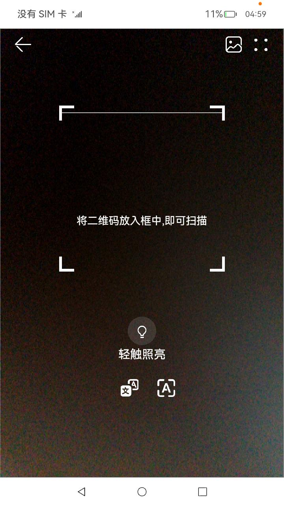

<p align="center">
  <h1 align="center">OpenHarmony应用实现二维码扫码识别</h1>
</p>

<!-- panels:start -->

<!-- div:title-panel -->

## 概念介绍

<!-- div:left-panel -->

二维码的应用场景非常广泛，在购物应用中，消费者可以直接扫描商品二维码，浏览并购买产品，如图是购物应用的扫描二维码的页面。

本文就以[橘子购物示例应用](https://gitee.com/openharmony/applications_app_samples/tree/master/code/Solutions/Shopping/OrangeShopping)为例，来讲解OpenHarmony应用二维码开发相关的技术点。

我们先看下二维码相关的几个概念。

- 二维码生成

OpenHarmony应用框架提供了[QRCode组件](https://docs.openharmony.cn/pages/v4.0/zh-cn/application-dev/reference/arkui-ts/ts-basic-components-qrcode.md/)，用于显示单个二维码的组件。该组件只能用于显示二维码，无法显示条码与解析码内容。

- 二维码解析

OpenHarmony提供了功能强大的三方库 @ohos/zxing，是一个解析/生成一维码/二维码的库。详细内容可以参考[@ohos/zxing](https://gitee.com/openharmony-tpc/zxing)。

二维码解析时，通常有两种方式，使用相机拍摄获取图片或打开相册选取图片，然后图片解析合适的图片格式，进行二维码解析。

<!-- div:right-panel -->

[橘子购物示例应用](https://gitee.com/openharmony/applications_app_samples/tree/master/code/Solutions/Shopping/OrangeShopping)扫描二维码的示例图：
<p align="center">

</p>

<!-- div:title-panel -->
## 配置文件

了解了二维码相关的概念后，我们看下[橘子购物示例应用](https://gitee.com/openharmony/applications_app_samples/tree/master/code/Solutions/Shopping/OrangeShopping)的oh-package.json5配置文件。

<!-- div:left-panel -->

在[橘子购物示例应用](https://gitee.com/openharmony/applications_app_samples/tree/master/code/Solutions/Shopping/OrangeShopping)中，实现首页二维码扫描的页面的文件位置为：[entry/src/main/ets/pages/ScanPage.ets](https://gitee.com/openharmony/applications_app_samples/blob/master/code/Solutions/Shopping/OrangeShopping/entry/src/main/ets/pages/ScanPage.ets)。文件内容如下：

```javascript
import { QRCodeScanComponent } from "@ohos/scan-component"
@Entry
@Component
struct Scan {
  build() {
    Column() {
      QRCodeScanComponent()
    }
  }
}
```
内容非常简单，主要是导入的自定义组件QRCodeScanComponent，这个组件的代码来自：[二维码扫描示例应用](https://gitee.com/openharmony/applications_app_samples/tree/master/code/BasicFeature/Media/QRCodeScan)，后文我们这样分析如何开发这个二维码扫描应用。

从这一行，可以了解到OpenHarmony应用如何引用ohpm本地三方库。
```json
 "@ohos/scan-component": "file:../libs/ohos-qr-code-scan-1.0.1.har",
```

<!-- div:right-panel -->

oh-package.json5配置文件片段如下：
```json5
{
  "license": "ISC",
  "devDependencies": {},
  "name": "product",
  "description": "example description",
  "repository": {},
  "version": "1.0.0",
  "dependencies": {
    "@ohos/http": "file:../libs/ohos-http-1.0.0.tgz",
    "@ohos/video-component": "file:../libs/ohos-video-component-1.0.5.tgz",
    "@ohos/details-page-component": "file:../feature/detailPage",
    "@ohos/notification": "file:../libs/ohos-notification-1.0.0.tgz",
    "@ohos/scan-component": "file:../libs/ohos-qr-code-scan-1.0.1.har",
    "@ohos/updatedialog": "file:../libs/ohos-updatedialog-1.0.0.tgz",
    "@ohos/enter-animation": "file:../libs/ohos-enter-animation-1.0.1.tgz",
    "@ohos/share-component": "file:../libs/ohos-sharecomponent-1.0.1.tgz",
    "@ohos/emitter": "file:../feature/emitter",
    "@ohos/navigation-component": "file:../feature/navigationHome"
  }
}
```
<!-- panels:end -->

## 开发步骤

我们来看二维码扫描功能是如何开发的。

<!-- panels:start -->

<!-- div:title-panel -->

### 导入ohpm三方库

<!-- div:left-panel -->

在开发前，我们需要导入ohpm组件库：@ohos/zxing。可以使用命令行方式导入`ohpm install @ohos/zxing`，也可以直接在文件[entry\oh-package.json5](https://gitee.com/openharmony/applications_app_samples/blob/master/code/BasicFeature/Media/QRCodeScan/entry/oh-package.json5)中配置，如文件片段所示。

可以看出，二维码扫描的核心代码存放在Feature目录，是一个独立的module模块，方便复用：

["@ohos/feature-qr-code-scan": "file:../Feature"](https://gitee.com/openharmony/applications_app_samples/tree/master/code/BasicFeature/Media/QRCodeScan/Feature)。

<!-- div:right-panel -->

文件[entry\oh-package.json5](https://gitee.com/openharmony/applications_app_samples/blob/master/code/BasicFeature/Media/QRCodeScan/entry/oh-package.json5)片段:

```json
  "dependencies": {
    "@ohos/feature-qr-code-scan": "file:../Feature",
    "@ohos/zxing": "^2.0.0"
  }  
```

<!-- panels:end -->

<!-- panels:start -->
<!-- div:title-panel -->
### 相机服务

<!-- div:left-panel -->
[CameraService.ets](https://gitee.com/openharmony/applications_app_samples/blob/master/code/BasicFeature/Media/QRCodeScan/Feature/src/main/ets/qrcodescan/CameraService.ets)文件相机服务构造函数中，会创建一个图片接收器。

该图片接收器可以监听'imageArrival'事件，当相机拍照时会触发该事件。在监听事件的回调函数里，实现对拍照的图片进行处理。
<!-- div:right-panel -->
CameraService.ets文件相机服务构造函数：
```javascript
constructor(imgReceiver?: image.ImageReceiver) {
    if (imgReceiver === undefined) {
      this.imageReceiver = image.createImageReceiver(QRCodeScanConst.IMG_DEFAULT_SIZE.WIDTH,
      QRCodeScanConst.IMG_DEFAULT_SIZE.HEIGHT, image.ImageFormat.JPEG, QRCodeScanConst.MAX_IMAGE_CAPACITY)
    } else {
      this.imageReceiver = image.createImageReceiver(imgReceiver.size.width, imgReceiver.size.height,
      imgReceiver.format, imgReceiver.capacity)
    }
  }
```

<!-- div:left-panel -->
在[CameraService.ets](https://gitee.com/openharmony/applications_app_samples/blob/master/code/BasicFeature/Media/QRCodeScan/Feature/src/main/ets/qrcodescan/CameraService.ets)文件创建相机函数中，主要包含如下几个步骤：

- 获取支持的相机

根据context获取CameraManager，然后获取支持的相机（摄像头）。如果没有支持的相机，则然后。

如有支持的相机，则默认使用相机列表中的第一个。实际应用中，对于二维码扫描，需要使用后置相机摄像头。

- 获取相机输入输出流

首先，根据指定的相机，创建相机输入流`this.cameraInput`。

然后，获取相机的cameraOutputCapability参数，接着创建两个输出流：

1、 预览输出流

创建相机预览输出流this.previewOutput，使用的surfaceId来自XComponent组件。预览输出流，对应相机拍照前的图片预览。

2、相片输出流

创建相片输出流this.photoOutput，使用的receivingSurfaceId来自上文创建的图片接收器。相片输出流，用于保存到相片。

- 配置相机会话

配置相机会话，也比较简单，添加输入流和输出流即可，见代码及其注释。

<!-- div:right-panel -->
CameraService.ets文件创建相机函数：
```javascript
  /**
   * 创建相机
   */
  async createCamera(surfaceId: string) {
    Logger.info("createCamera start")
    // 根据context获取CameraManager
    let cameraManager = camera.getCameraManager(AppStorage.Get('context'))
    // 获取Camera对象数组
    let cameras = cameraManager.getSupportedCameras()
    // 没有相机就停止
    if (cameras.length === 0) {
      Logger.error("createCamera: cameras length is 0.")
      return
    }
    // 拿到相机列表中的第一个默认相机id, 根据id获取相机输入流
    this.cameraInput = cameraManager.createCameraInput(cameras[0])
    this.cameraInput.open()
    // 获取cameraOutputCapability参数
    let cameraOutputCapability = cameraManager.getSupportedOutputCapability(cameras[0])
    // 获取相机输出流
    this.previewOutput = cameraManager.createPreviewOutput(cameraOutputCapability.previewProfiles[0], surfaceId)
    // 获取一个可以创建相片输出流的id
    let receivingSurfaceId = await this.imageReceiver.getReceivingSurfaceId()
    // 创建相片输出流
    this.photoOutput = cameraManager.createPhotoOutput(cameraOutputCapability.photoProfiles[0], receivingSurfaceId)
    // 获取捕获会话的实例
    this.captureSession = cameraManager.createCaptureSession()
    // 开始会话配置
    this.captureSession.beginConfig()
    // 使用相机输入流---添加一个摄像头输入流
    this.captureSession.addInput(this.cameraInput)
    // 使用相机输出流---添加一个摄像头输出
     this.captureSession.addOutput(this.previewOutput)
    // 使用相片输出流---添加相机照片的输出
    this.captureSession.addOutput(this.photoOutput)
    // 结束并提交配置
    await this.captureSession.commitConfig()
    // 开始捕获会话
    await this.captureSession.start()
    Logger.info("createCamera end")
  }
```

<!-- div:left-panel -->
[CameraService.ets](https://gitee.com/openharmony/applications_app_samples/blob/master/code/BasicFeature/Media/QRCodeScan/Feature/src/main/ets/qrcodescan/CameraService.ets)文件拍照函数中，指定相片参数设置，然后调用capture()函数完成拍照。

拍照后会触发图片接收器的'imageArrival'事件。拍照函数在使用相机扫描二维码的时候调用。

该图片接收器可以监听'imageArrival'事件，当相机拍照时会触发该事件。在监听事件的回调函数里，实现对拍照的图片进行处理。

<!-- div:right-panel -->
CameraService.ets文件拍照函数：
```javascript
  takePicture() {
    let photoSetting = {
      rotation: camera.ImageRotation.ROTATION_0,
      quality: camera.QualityLevel.QUALITY_LEVEL_MEDIUM,
      mirror: false
    }
    this.photoOutput.capture(photoSetting)
  }
```

<!-- div:title-panel -->
### 二维码解析实现代码

<!-- div:left-panel -->

二维码解析类文件为：[QRCodeParser.ets](https://gitee.com/openharmony/applications_app_samples/blob/master/code/BasicFeature/Media/QRCodeScan/Feature/src/main/ets/qrcodescan/QRCodeParser.ets)，支持拍照识别二维码，还支持从相册选择二维码图片进行识别。

我们首先看下如何解析从相机获取的二维码图片，对应函数为：`parseQRCodeImageFromCamera`，该类指定一个时间随机的图片文件名，图片归档格式，然后继续调用函数`parseQRCodeImageWithNameFromCamera`。
```javascript
  /**
   * 解析从相机获取的二维码图片
   *
   * @param cameraService
   * @param canvasContext
   */
  parseQRCodeImageFromCamera(cameraService: CameraService,
                             imageComponentType?: image.ComponentType): void {
    Logger.info("parseQRCodeImageFromCamera start")
    let fileName = this.getRandomFileName(QRCodeScanConst.IMG_FILE_PREFIX, QRCodeScanConst.IMG_SUFFIX_JPG)
    this.parseQRCodeImageWithNameFromCamera(cameraService, fileName, imageComponentType);
    Logger.info("parseQRCodeImageFromCamera end")
  }
```

在函数`parseQRCodeImageWithNameFromCamera`中，注册图片接收器监听'imageArrival'事件，在监听函数里，对二维码图片进行解析识别。

当相机对二维码拍照后，二维码图片会被保存到指定的目录下，返回文件URI。保存图片的函数`createPublicDirFileAsset`的实现，可以自行查阅源码。

根据返回的图片URI，调用函数`parseImageQRCode`对二维码进行解析。函数`parseImageQRCode`后文会介绍。

如果解析失败，弹窗提示解析失败。如果解析成功，会被解析结果保存到AppStorage。

保存到AppStorage的二维码解析结果会被@watch装饰器的变量监视，当监视到有二维码识别结果后，会在界面展示，后文会介绍。


<!-- div:right-panel -->
QRCodeParser.ets文件parseQRCodeImageWithNameFromCamera函数代码：
```javascript
  /**
   * 解析从相机获取的二维码图片，指定文件名称
   *
   * @param cameraService
   * @param canvasContext
   */
  parseQRCodeImageWithNameFromCamera(cameraService: CameraService,
                                     fileDisplayName: string,
                                     imageComponentType?: image.ComponentType): void {
    Logger.info("parseQRCodeImageWithNameFromCamera...")
    cameraService.imageReceiver.on('imageArrival', async () => {
      Logger.info("parseQRCodeImageWithNameFromCamera imageArrival start")
      // 从接收器获取下一个图像，并返回结果
      let targetImage: image.Image = await cameraService.imageReceiver.readNextImage()
      // 默认按JPEG格式处理
      let imgComponentType = imageComponentType === undefined ? image.ComponentType.JPEG : imageComponentType
      let imageComponent = await targetImage.getComponent(imgComponentType)
      // 将image的ArrayBuffer写入指定文件中，返回文件uri
      let imageUri = await this.createPublicDirFileAsset(fileDisplayName, mediaLibrary.MediaType.IMAGE,
                     mediaLibrary.DirectoryType.DIR_IMAGE, imageComponent.byteBuffer);
      // 释放已读取的image资源，以便处理下一个资源
      await targetImage.release()

      // 解析二维码
      let qrCodeParseRlt = await this.parseImageQRCode(imageUri);
      if (!qrCodeParseRlt.isSucess) {
        Logger.error("parseQRCodeImageWithNameFromCamera qrCodeParseRlt is null")
        prompt.showToast({
          message: $r('app.string.qrCodeNotRecognized')
        })
        return;
      }
      // 拼接解析结果
      AppStorage.SetOrCreate(QRCodeScanConst.QR_CODE_PARSE_RESULT, qrCodeParseRlt.decodeResult);
      Logger.info("parseQRCodeImageWithNameFromCamera imageArrival end")
    })
  }
```

<!-- div:left-panel -->

二维码解析类文件为：[QRCodeParser.ets](https://gitee.com/openharmony/applications_app_samples/blob/master/code/BasicFeature/Media/QRCodeScan/Feature/src/main/ets/qrcodescan/QRCodeParser.ets)，支持拍照识别二维码，还支持从相册选择二维码图片进行识别。

我们接着，再看下如何解析从相册里挑选的二维码图片。

参数imageSrc为选定图片的URI地址。

getImageSource()代码可以自行查询，实现根据图片URI返回图片的宽、高，以及图片的pixelMap数据。然后，把像素数据写入ArrayBuffer，供zxing二维码识别程序使用。

函数RGBLuminanceSource、BinaryBitmap、BinaryBitmap等都是zxing的类。通过调用MultiFormatReader的decode函数对二维码图像进行解析。

如果解析成功，会返回成功的标记和解析的结果。

如果解析失败，会在catch语句块里进行处理，会返回失败的标记和解析失败的原因。

<!-- div:right-panel -->
QRCodeParser.ets文件parseImageQRCode函数代码：
```javascript
 /**
   * 解析图片二维码信息
   * @param canvasContext
   * @param imageSrc
   */
  async parseImageQRCode(imageSrc: string): Promise<DecodeResultAttribute> {
    Logger.info(`parseImageQRCode start`);
    // 获取图片的宽高
    let imageSource = await this.getImageSource(imageSrc);
    let imageWidth = imageSource.width;
    let imageHeight = imageSource.height;
    // 获取PixelMap图片数据
    let pixMapData = imageSource.pixelMap;
    let pixelBytesNumber = pixMapData.getPixelBytesNumber();
    let arrayBuffer: ArrayBuffer = new ArrayBuffer(pixelBytesNumber);
    // 读取图像像素数据，结果写入ArrayBuffer里
    await pixMapData.readPixelsToBuffer(arrayBuffer);
    let int32Array = new Int32Array(arrayBuffer);
    let luminanceSource = new RGBLuminanceSource(int32Array, imageWidth, imageHeight);
    let binaryBitmap = new BinaryBitmap(new HybridBinarizer(luminanceSource));
    let mltiFormatReader = new MultiFormatReader();
    let hints = new Map();
    hints.set(DecodeHintType.POSSIBLE_FORMATS, [BarcodeFormat.QR_CODE]);
    mltiFormatReader.setHints(hints);
    try {
      // 解析二维码
      let decodeResult = mltiFormatReader.decode(binaryBitmap);
      let decodeText = decodeResult.getText();
      Logger.info(`parseImageQRCode end ${decodeText}`);
      return { isSucess: true, decodeResult: decodeText };
    } catch (err) {
      let error = `The error is ${err}`;
      Logger.info(`parseImageQRCode end`);
      return { isSucess: false, decodeResult: error };
    }
  }
```
<!-- div:title-panel -->
### 相机扫描识别二维码

<!-- div:left-panel -->
在文件[QRCodeScanComponent.ets](https://gitee.com/openharmony/applications_app_samples/blob/master/code/BasicFeature/Media/QRCodeScan/Feature/src/main/ets/qrcodescan/components/QRCodeScanComponent.ets)中实现了二维码扫描自定义组件。我们看下该文件中如何实现相机扫描二维码的。

在二维码扫描组件的aboutToAppear()函数调用的watchCameraPermission()函数，用于使用相机扫描二维码进行识别。

在watchCameraPermission()函数中，使用setInterval函数每100ms判断下是否具有相机权限，当有相机权限的时候，才能使用相机扫描二维码。

当具备相机权限时 ，使用setInterval函数每4000ms轮询判断下是否识别到二维码图片，如果识别到则取消执行轮询。

如果没有识别到二维码，则继续调用函数takePicture()拍照。调用该函数后，会触发图片接收器的监听事件'imageArrival'，对这个事件的监听分析，见上文。

<!-- div:right-panel -->
文件QRCodeScanComponent.ets中，相机拍照识别二维码的代码片段：
```javascript
aboutToAppear() {
// 监听相机权限
this.watchCameraPermission()
// 设置扫描动画
this.setQRCodeScanAnimation()
// 解析二维码图片信息
this.qrCodeParser.parseQRCodeImageFromCamera(this.cameraService);
}
......
// 监听相机权限变化
watchCameraPermission() {
let interval = setInterval(() => {
  this.hasCameraPermission = AppStorage.Get(QRCodeScanConst.HAS_CAMERA_PERMISSION)
  if (this.hasCameraPermission) {
	let qrCodeScanInterval = setInterval(() => {
	  if (this.qrCodeParseResult.length > 0 || this.isQRCodeScanStopped) {
		clearInterval(qrCodeScanInterval)
	  }
	  // 拍照
	  this.cameraService.takePicture()
	}, 4000)
	clearInterval(interval)
  }
}, 100)
}
```

<!-- div:title-panel -->
### 识别相册二维码图片

<!-- div:left-panel -->
在文件[QRCodeScanComponent.ets](https://gitee.com/openharmony/applications_app_samples/blob/master/code/BasicFeature/Media/QRCodeScan/Feature/src/main/ets/qrcodescan/components/QRCodeScanComponent.ets)中实现了二维码扫描自定义组件。我们看下该文件中如何识别相册二维码图片。

首先，设置this.isQRCodeScanStopped为true，这个会关闭相机拍照识别二维码。

然后，通过startAbilityForResult启动相册应用，供用户选择二维码图片。

如果选择图片失败，则弹窗报错。

如果选择图片成功，则调用二维码解码函数parseImageQRCode完成对图片二维码的识别。

如果识别二维码成功，则弹窗展示二维码结果。

如果识别识别，则toast展示：未识别到二维码。

<!-- div:right-panel -->
文件QRCodeScanComponent.ets中，相册选择二维码图片进行识别代码片段：
```javascript
Image($r('app.media.scan_photo'))
  .width(30)
  .height(30)
  .id('scanPhoto')
  .onClick(async () => {
	// 打开相册获取图片
	this.isQRCodeScanStopped = true
	let context = AppStorage.Get('context') as common.UIAbilityContext
	await context.startAbilityForResult({
	  parameters: { uri: 'singleselect' },
	  bundleName: 'com.ohos.photos',
	  abilityName: 'com.ohos.photos.MainAbility',
	}).then(data => {
	  // 获取want数据
	  let want = data['want'];
	  if (want) {
		// param代表want参数中的paramters
		let param = want['parameters'];
		if (param) {
		  // 被选中的图片路径media/image/8
		  let selectedUri = param['select-item-list'];
		  setTimeout(async () => {
			if (!selectedUri) {
			  prompt.showToast({
				message: $r('app.string.queryImageFailed'),
				duration: 1000
			  })
			  return;
			}
			// 获取解析数据
			let qrCodeParseRlt = await this.qrCodeParser.parseImageQRCode(selectedUri[0]);
			if (qrCodeParseRlt.isSucess) {
			  prompt.showDialog({
				title: $r('app.string.qrcodeResult'),
				message: qrCodeParseRlt.decodeResult
			  })
			} else {
			  prompt.showToast({
				message: $r('app.string.qrCodeNotRecognized')
			  })
			}
		  }, 50)
		}
	  }
	})
  })
```

<!-- div:title-panel -->
### 二维码扫描组件界面
<!-- div:left-panel -->
在文件[QRCodeScanComponent.ets](https://gitee.com/openharmony/applications_app_samples/blob/master/code/BasicFeature/Media/QRCodeScan/Feature/src/main/ets/qrcodescan/components/QRCodeScanComponent.ets)中实现了二维码扫描自定义组件。我们看下二维码扫描组件的页面布局。

整个页面使用Stack进行堆叠布局。

如果有相机权限，会XComponent组件，用于展示相机的预览输出流。XComponent组件的onLoad函数里会创建相机，onDestroy函数里会释放相机。

`Image($r('app.media.scan_border'))`图片就是二维码扫描框，引导用户把二维码放到框内进行扫描识别。

Divider是个分割线，该分割线使能了动画效果，在识别二维码的过程中，分割线从二维码识别框里从上到下移动。扫描动画实现代码如下：
```javascript
  // 扫描扫描动画
  setQRCodeScanAnimation() {
    setInterval(() => {
      animateTo({
        duration: 1000, // 动画时间
        tempo: 0.5, // 动画速率
        curve: Curve.EaseInOut,
        delay: 200, // 动画延迟时间
        iterations: -1, // 动画是否重复播放
        playMode: PlayMode.Normal,
      }, () => {
        this.animationOrdinate = 390 // 扫描动画结束Y坐标
      })
    }, 2000)
  }
```
`Text($r('app.string.putTheQRCodeToScan'))`引导用户把二维码放到框内进行扫描识别。

`Image($r('app.media.scan_back'))`返回退出应用。

`Image($r('app.media.scan_photo'))`从相册里挑选二维码图片进行识别。


<!-- div:right-panel -->

```javascript
build() {
Column() {
  Stack() {
	if (this.hasCameraPermission) {
	  XComponent({
		id: 'componentId',
		type: 'surface',
		controller: this.xComponentController
	  })
		.onLoad(() => {
		  // 适配可能需要获取设备信息
		  this.xComponentController.setXComponentSurfaceSize({
			surfaceWidth: QRCodeScanConst.IMG_DEFAULT_SIZE.WIDTH,
			surfaceHeight: QRCodeScanConst.IMG_DEFAULT_SIZE.HEIGHT
		  })
		  this.surFaceId = this.xComponentController.getXComponentSurfaceId()
		  this.cameraService.createCamera(this.surFaceId)
		})
		.onDestroy(() => {
		  this.cameraService.releaseCamera()
		})
		.height('100%')
		.width('100%')
	}
	Column() {
	  Column() {
		Image($r('app.media.scan_border'))
		......
		Divider()
		  .strokeWidth(1)
		  .height(4)
		  .width('100%')
		  .color(Color.White)
		  .width('100%')
		  .position({ x: 0, y: 0 })
		  .translate({ x: 0, y: this.animationOrdinate })
	  }
	......
	  Text($r('app.string.putTheQRCodeToScan'))
	......
	}
	......
	Row() {
	  Image($r('app.media.scan_back'))
	  ......
	  Row({ space: 16 }) {
		Image($r('app.media.scan_photo'))
		......
}
```

<!-- panels:end -->

### 运行测试效果

可以下载[橘子购物示例应用](https://gitee.com/openharmony/applications_app_samples/tree/master/code/Solutions/Shopping/OrangeShopping)代码，使用DevEco Studio编译构建，使用Simulator模拟器或者真实设备进行运行体验。可以体验下使用相机对二维码图片进行识别，还可以尝试下识别相册中的二维码图片。

```shell
git init
git config core.sparsecheckout true
echo code/Solutions/Shopping/OrangeShopping/ > .git/info/sparse-checkout
git remote add origin https://gitee.com/openharmony/applications_app_samples.git
git pull origin master
```


## 注意事项

当前二维码示例应用识别相册的二维码，弹出识别结果后，程序会崩溃，已经提单跟踪。示例程序待改进。

使用相机功能直接拍摄二维码的功能，一直没有成功运行，需要进一步优化。

## 参考资料

[橘子购物示例应用](https://gitee.com/openharmony/applications_app_samples/tree/master/code/Solutions/Shopping/OrangeShopping)

[二维码扫描示例应用](https://gitee.com/openharmony/applications_app_samples/tree/master/code/BasicFeature/Media/QRCodeScan)

[@ohos/zxing](https://gitee.com/openharmony-tpc/zxing)

[QRCode组件](https://docs.openharmony.cn/pages/v4.0/zh-cn/application-dev/reference/arkui-ts/ts-basic-components-qrcode.md/)

[相机开发概述](https://docs.openharmony.cn/pages/v4.0/zh-cn/application-dev/media/camera-overview.md/)

[图片开发概述](https://docs.openharmony.cn/pages/v4.0/zh-cn/application-dev/media/image-overview.md/)

[XComponent](https://docs.openharmony.cn/pages/v4.0/zh-cn/application-dev/ui/arkts-common-components-xcomponent.md/)
