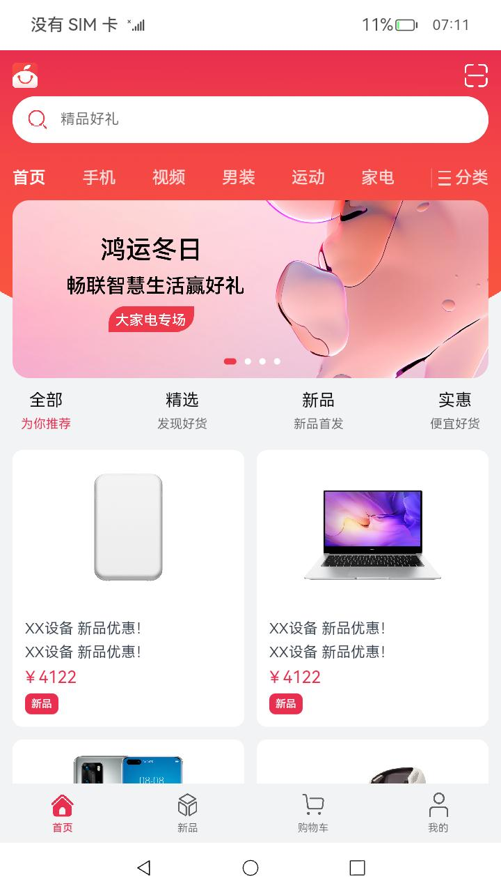
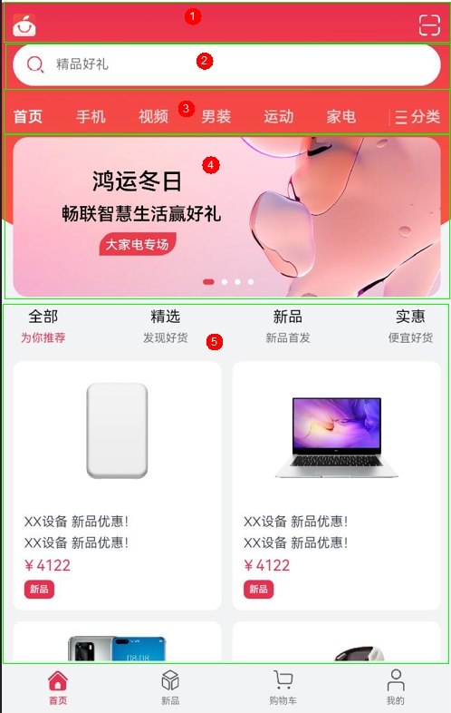
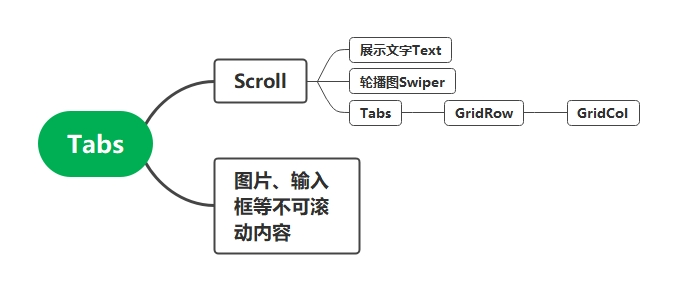
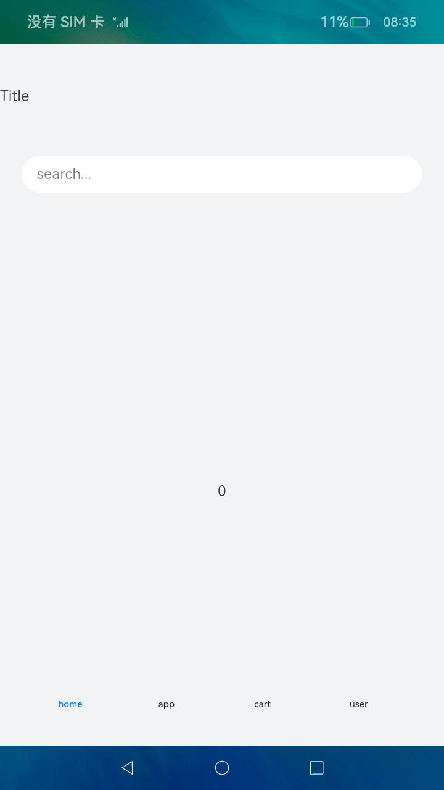

# 如何开发一个OpenHarmony购物app导航页面

购物类App是现在最常用的一类App，也是我们在应用开发中经常遇到的场景。一款购物App界面通常包括了扫一扫功能、搜索框、轮播图、标签页、商品列表等功能，我们以[橘子购物](https://gitee.com/openharmony/applications_app_samples/tree/master/code/Solutions/Shopping/OrangeShopping)为例，介绍一下如何使用ArkTS开发一个购物类App。首先我们可以看一下最终实现效果：



如上图所示，首先最外层是一个可以切换切换的标签页，分别对应首页、新品、购物车以及我的等四个栏目。页面整体结构可以通过Tabs组件实现，通过阅读[Tabs组件](https://gitee.com/openharmony/docs/blob/master/zh-cn/application-dev/reference/arkui-ts/ts-container-tabs.md)的API文档，注意到Tabs包含子组件TabContent即可实现选项卡效果。我们可以快速构造出如下所示的整体结构：

```javascript
  private controller: TabsController = new TabsController()

  Column() {
    Tabs({
      barPosition: BarPosition.END,
      controller: this.controller
    }) {
      TabContent() {
      }

      TabContent() {
      }

      TabContent() {
      }

      TabContent() {
      }
    }
  }.width('100%')
```

其中barPosition控制选择栏位置，BarPosition.END表示选择栏在页面下方，BarPosition.START表示选择栏在页面上方，同时定义一个TabsController来控制Tabs切换逻辑。图中选择栏各个栏目都有相同的结构，都是图片加标题，这部分样式在TabContent的tabBar属性中设计，我们如下示例代码使用@Builder装饰方法来定义组件的声明式UI描述。

```javascript
  @Builder TabBarBuilder(index: number) {
      Column() {
      Image(this.getTabBarImage(index))
      Text(TAB_TITLE_DATA[index].title)
      }
      .justifyContent(FlexAlign.Center)
      .width('100%')
      .height('100%')
      .onClick(() => {
      this.controller.changeIndex(index)
      })
  }
  ...
  TabContent() {
        MainPage({ url: this.url })
      }.tabBar(this.TabBarBuilder(0))
  TabContent() {
        NewProduct({ url: this.url })
      }.tabBar(this.TabBarBuilder(1))
  TabContent() {
        ShopCart({ url: this.url })
      }.tabBar(this.TabBarBuilder(2))
  TabContent() {
        User()
      }.tabBar(this.TabBarBuilder(3))
```

其中MainPage，NewProduct，ShopCart，User表示各个页面的具体内容。常见的App通常是通过点击切换的，而不能通过滑动切换，如果想要禁用Tab的滑动切换可以使用将Tab的scrollable属性设计为false来实现。Tabs实现四个栏目切换达到上图效果的整体代码可以参考[NavigationHomePage](
https://gitee.com/openharmony/applications_app_samples/blob/master/code/Solutions/Shopping/OrangeShopping/feature/navigationHome/src/main/ets/main/NavigationHomePage.ets)

实现完最外层容器的标签页切换介绍后，我们再对主页进行简单介绍。首先对主页内容从上到下可以进行一个简单分解:



一号框中包含两张图片，使用两个image组件，其中二维码图片可以在onClick事件加入跳转逻辑跳转到二维码模块。
二号框为一个搜索框，使用TextInput组件。(示例代码中无具体功能，通过Image+Text进行展示)
这两部分代码可以参考[TitleBar](https://gitee.com/openharmony/applications_app_samples/blob/master/code/Solutions/Shopping/OrangeShopping/feature/navigationHome/src/main/ets/components/home/TitleBar.ets)
根据我们以往使用购物App的经验，我们可以知道下滑过程中，最上方图片以及搜索框是一直存在的，即一二号框固定不动，三四五号框可以上下滑动，要实现这种效果只需要将后面三个框放到 Scroll组件中即可
三号框可以使用Tab组件，参考代码见[MainPage](https://gitee.com/openharmony/applications_app_samples/blob/master/code/Solutions/Shopping/OrangeShopping/feature/navigationHome/src/main/ets/components/home/MainPage.ets),示例代码中未实现具体功能，使用了Text进行展示
四号框轮播图中使用Swiper实现轮播图效果,实现代码可以参考[Swiper](https://gitee.com/openharmony/applications_app_samples/blob/master/code/Solutions/Shopping/OrangeShopping/feature/navigationHome/src/main/ets/components/home/Swiper.ets)
五号框是主页下半部分商品展示，这一部分看作一个Tabs，4个标签分别对应全部、精选、新品、实惠，每个Tab中包含了一个商品列表，列表中整齐地排列着各个商品元素，这类像栅格一样的场景我们可以通过GridRow嵌套GridCol实现，具体代码见[HomePageContent](https://gitee.com/openharmony/applications_app_samples/blob/master/code/Solutions/Shopping/OrangeShopping/feature/navigationHome/src/main/ets/components/home/HomePageContent.ets)
综上所述，可以简单地画出导航页对应的结构图



### 效果对比

|                                                                                      |                                                                                                          |                                                                                          |
| ------------------------------------------------------------------------------------ | -------------------------------------------------------------------------------------------------------- | ---------------------------------------------------------------------------------------- |
|  |  |  |

我们将橘子购物实现效果与市面是常用的两款购物APP京东与闲鱼界面放在一起进行一个简单对比，我们可以发现作为一个示例，在美观方面与真实APP还是存在不小的差距，但是整体结构上基本相同，能够实现一个购物类应用的界面。
对于想要快速实现整体框架效果的读者,还可以使用如下代码通过Navigation+Tabs方式来快速实现。

### 完整实现代码

```javascript
    @Entry
    @Component
    struct NavigationExample {
      @State currentIndex: number = 0
      @State Build: Array<Object> = [
        {
          text: 'home',
          num: 0
        },
        {
          text: 'app',
          num: 1
        },
        {
          text: 'cart',
          num: 2
        },
        {
          text: 'user',
          num: 3
        }
      ]

      @Builder NavigationTitle() {
        Column() {
          Text('Title')
            .height('100%')
        }.alignItems(HorizontalAlign.Start)
      }

      @Builder NavigationToolbar() {
        Row() {
          ForEach(this.Build, item => {
            Column() {
              Text(item.text)
                .fontColor(this.currentIndex == item.num ? '#007DFF' : '#182431')
                .fontSize(10)
                .lineHeight(14)
                .fontWeight(500)
                .margin({ top: 3 })
            }.width(104).height(56)
            .onClick(() => {
              this.currentIndex = item.num
            })
          })
        }.margin({ left: 24 })
      }

      build() {
        Column() {
          Navigation() {
            TextInput({ placeholder: 'search...' })
              .width('90%')
              .height(40)
              .backgroundColor('#FFFFFF')
              .margin({ top: 8 })
            Tabs({
              index:this.currentIndex
            }){
              TabContent(){
                Text('0')
              }
              TabContent(){
                Text('1')
              }
              TabContent(){
                Text('2')
              }
              TabContent(){
                Text('3')
              }
            }
          }
          .title(this.NavigationTitle)
          .toolBar(this.NavigationToolbar)
        }.width('100%').height('100%').backgroundColor('#F1F3F5')
      }
    }
```

### 实现效果



  读者可以在这个基础上添加所需要的组件，也可以完成一个购物类App界面。
