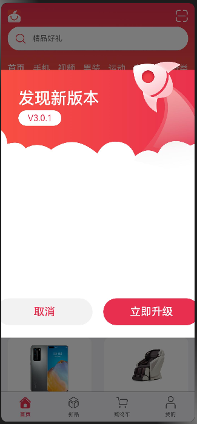

# OpenHarmony应用开发之自定义弹窗

## 应用场景

在应用的使用和开发中，弹窗是一个很常见的场景，自定义弹窗又因为极高的自由度得以广泛应用。本文以[橘子购物](https://gitee.com/openharmony/applications_app_samples/tree/master/code/Solutions/Shopping/OrangeShopping)中一个应用更新提示的弹窗介绍OpenHarmony的自定义弹窗。



## 接口

自定义弹窗官方文档：[自定义弹窗-弹窗-全局UI方法-组件参考（基于ArkTS的声明式开发范式）-ArkTS API参考-HarmonyOS应用开发](https://developer.harmonyos.com/cn/docs/documentation/doc-references-V3/ts-methods-custom-dialog-box-0000001477981237-V3#ZH-CN_TOPIC_0000001574128801__customdialogcontroller)

CustomDialogController是自定义弹窗对应的接口，详细介绍如下：

```javascript
CustomDialogController(value:{builder: CustomDialog, cancel?: () => void, autoCancel?: boolean, alignment?: DialogAlignment, 
                      offset?: Offset, customStyle?: boolean, gridCount?: number, maskColor?: ResourceColor, 
                      openAnimation?: AnimateParam, closeAniamtion?: AnimateParam})
```

**参数:**

| 参数名      | 参数类型                                                     | 必填 | 参数描述                                                     |
| ----------- | ------------------------------------------------------------ | ---- | ------------------------------------------------------------ |
| builder     | CustomDialog                                                 | 是   | 自定义弹窗内容构造器。                                       |
| cancel      | () => void                                                   | 否   | 点击遮障层退出时的回调。                                     |
| autoCancel  | boolean                                                      | 否   | 是否允许点击遮障层退出。默认值：true                         |
| alignment   | [DialogAlignment](https://developer.harmonyos.com/cn/docs/documentation/doc-references-V3/ts-methods-alert-dialog-box-0000001478341185-V3#ZH-CN_TOPIC_0000001523968878__dialogalignment枚举说明) | 否   | 弹窗在竖直方向上的对齐方式。默认值：DialogAlignment.Default  |
| offset      | [Offset](https://developer.harmonyos.com/cn/docs/documentation/doc-references-V3/ts-types-0000001477981241-V3#ZH-CN_TOPIC_0000001573928889__offset) | 否   | 弹窗相对alignment所在位置的偏移量。                          |
| customStyle | boolean                                                      | 否   | 弹窗容器样式是否自定义。默认值：false，弹窗容器的宽度根据栅格系统自适应，<br>不跟随子节点；高度自适应子节点，最大为窗口高度的90%；圆角为24vp。 |
| gridCount8+ | number                                                       | 否   | 弹窗宽度占[栅格宽度](https://developer.harmonyos.com/cn/docs/documentation/doc-guides-V3/arkts-layout-development-grid-layout-0000001454765270-V3)的个数。默认为按照窗口大小自适应，异常值按默认值处理，<br>最大栅格数为系统最大栅格数。 |

这其中最重要的就是builder，我们需要自己实现一个构造器，也就是这个弹窗的页面。

## 具体实现

### 定义CustomDialogController

首先，我们需要定义一个CustomDialogController：

```typescript
UpdateDialogController: CustomDialogController = new CustomDialogController({
  builder: UpdateDialog(),
  customStyle: true
})
```

这个CustomDialogController就代表弹窗，UpdateDialog()是弹窗的具体实现，customStyle为ture就表示弹窗样式可以自定义。

### 设置调用时机

在这个场景中，我们想要每次打开应用的时候弹窗，其他时候不弹窗，我们需要在首页组件的aboutToAppear中加入以下代码：

```typescript
aboutToAppear() {
  if(AppStorage.Get('nowIndex') === undefined || AppStorage.Get('nowIndex') === 0){
    this.UpdateDialogController.open()
  }
}
```

aboutToAppear函数的调用时机是创建自定义组件的新实例后，执行其build()函数之前，所以在首页组件的aboutToAppear加入CustomDialogController的打开开逻辑可使弹窗仅在应用打开的时候触发。

aboutToAppear参考文档：[自定义组件的生命周期-组件参考（基于ArkTS的声明式开发范式）-ArkTS API参考-HarmonyOS应用开发](https://developer.harmonyos.com/cn/docs/documentation/doc-references-V3/arkts-custom-component-lifecycle-0000001482395076-V3#ZH-CN_TOPIC_0000001523488850__abouttoappear)

### 实现builder实例

实现实例可以直接在builder后面直接实现，也可以定义在其他文件中，然后通过调用的方式获取，本文以调用方式实现。

实例组件的定义前需加export才能暴露出去：

```
export struct UpdateDialog {}
```


弹窗上所需的数据和获取也需要在在此处定义：

```typescript
@CustomDialog
export struct UpdateDialog {
  @State currentVersion: string = ''
  @State richTextData: string = ''
  @State lastVersion: string = ''
  @State updateContent: string = ''
  private context?: AbilityContext
  private customDialogController?: CustomDialogController

  async aboutToAppear() {
    this.context = getContext(this) as AbilityContext
    this.richTextData = await dialogFeature.getRichTextData(this.context)
    Logger.info(TAG, `this.richTextData = ${this.richTextData}`)
    await this.getData()
  }

  async getData() {
    try {
      this.currentVersion = await dialogFeature.getCurrentVersion()
      let requestResponseContent: RequestResponseContent = await dialogFeature.getLastVersion()
      if (requestResponseContent.content === null || requestResponseContent.content === undefined) {
        return
      }
      this.updateContent = requestResponseContent.content
      if (requestResponseContent.versionName === null || requestResponseContent.versionName === undefined) {
        return
      }
      this.lastVersion = requestResponseContent.versionName
    } catch (err) {
      Logger.info(TAG, `getApplicationVersion is fail`)
    }
  }
  ...
```

以上是应用升级所需的数据结构及部分数据获取。


#### 弹窗具体实现

自定义弹窗的实现就是在原页面的基础上再加一层页面，页面内容自定义。

弹窗页面我们可以通过stack组件实现，stack组件会使容器内的子组件堆叠布局，使用stack的好处是可以添加一层遮罩效果。

```typescript
Stack() {
  // mask 遮罩层
  Column()
    .width('100%')
    .height('100%')
    .backgroundColor('#000000')
    .opacity(.4)
    
...
```

以上代码在stack的第一层设置了backgroundColor和opacity属性，这样会产生如开始示意图的遮罩效果。

需要注意的是，需要在取消按钮的调用函数中关闭弹窗，具体代码如下：

```typescript
Button($r('app.string.cancel'))
  .onClick(() => {
    this.customDialogController.close()
  })
```

弹窗完整代码：

```typescript
build() {
  Stack() {
    // mask 遮罩层
    Column()
      .width('100%')
      .height('100%')
      .backgroundColor('#000000')
      .opacity(.4)
    Column() {
      Stack({ alignContent: Alignment.TopStart }) {
        Text($r('app.string.update_title'))
          .fontSize(30)
          .fontColor('#FFFFFF')
          .fontWeight(500)
          .margin({ top: 70, left: 76 })

        Text(`V${(this.lastVersion || updateData.versionName)}`)
          .fontSize(16)
          .backgroundColor('#FFFFFF')
          .textAlign(TextAlign.Center)
          .fontColor('#E9304E')
          .borderRadius(20)
          .width(80)
          .aspectRatio(2.8)
          .margin({ top: 110, left: 76 })

        Column() {
          // 富文本容器
          Scroll() {
            Column() {
              if (this.richTextData) {
                RichText((this.updateContent || this.richTextData))
                  .width('100%')
                  .height('100%')
              }
            }
            .width('100%')
          }
          .height(200)

          Row() {
            Button($r('app.string.cancel'))
              .commonButtonStyle()
              .fontSize(20)
              .margin({ left: 10 })
              .fontColor('#E92F4F')
              .backgroundColor('rgba(0,0,0,0.05)')
              .margin({ right: 10 })
              .onClick(() => {
                this.customDialogController.close()
              })
              .key("cancel")

            Button($r('app.string.update_now'))
              .commonButtonStyle()
              .fontSize(20)
              .margin({ right: 10 })
              .fontColor('#FFFFFF')
              .backgroundColor('#E92F4F')
              .margin({ left: 10 })
              .onClick(() => {
                this.customDialogController.close()
              })
              .key("Now")
          }
          .margin({ top: 30 })
        }
        .width('100%')
        .padding({ left: 25, right: 25 })
        .margin({ top: 230 })
      }
      .height(600)
      .width('100%')
      .backgroundImage($r('app.media.update'), ImageRepeat.NoRepeat)
      .backgroundImageSize(ImageSize.Contain)
    }
    .width(480)
    .padding({ left: 16, right: 16 })
  }
  .width('100%')
  .height('100%')
}
```

以上是弹窗完整代码，需要注意的是，本例并未实现应用升级的具体逻辑，所以升级按钮的操作也是关闭弹窗。


## 参考

[本例参考的官方文档：橘子购物](https://gitee.com/openharmony/applications_app_samples/tree/master/code/Solutions/Shopping/OrangeShopping)

[自定义弹窗官方文档](https://developer.harmonyos.com/cn/docs/documentation/doc-references-V3/ts-methods-custom-dialog-box-0000001477981237-V3#ZH-CN_TOPIC_0000001574128801__customdialogcontroller)

[自定义组件的生命周期-aboutToAppear](https://developer.harmonyos.com/cn/docs/documentation/doc-references-V3/arkts-custom-component-lifecycle-0000001482395076-V3#ZH-CN_TOPIC_0000001523488850__abouttoappear)

[层叠布局（Stack）-构建布局-开发布局-基于ArkTS的声明式开发范式-UI开发-开发-HarmonyOS应用开发](https://developer.harmonyos.com/cn/docs/documentation/doc-guides-V3/arkts-layout-development-stack-layout-0000001454605342-V3)

[线性布局（Row/Column）-构建布局-开发布局-基于ArkTS的声明式开发范式-UI开发-开发-HarmonyOS应用开发](https://developer.harmonyos.com/cn/docs/documentation/doc-guides-V3/arkts-layout-development-linear-0000001504125349-V3)

[按钮（Button）-添加常用组件-添加组件-基于ArkTS的声明式开发范式-UI开发-开发-HarmonyOS应用开发](https://developer.harmonyos.com/cn/docs/documentation/doc-guides-V3/arkts-common-components-button-0000001450914110-V3)