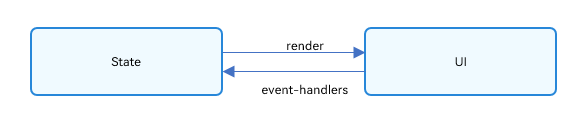

# OpenHarmony应用ArkUI 状态管理开发范例

本文根据[橘子购物应用](https://gitee.com/openharmony/applications_app_samples/blob/master/code/Solutions/Shopping/OrangeShopping)，实现ArkUI中的状态管理。

在声明式UI编程框架中，UI是程序状态的运行结果，用户构建了一个UI模型，其中应用的运行时的状态是参数。当参数改变时，UI作为返回结果，也将进行对应的改变。这些运行时的状态变化所带来的UI的重新渲染，在ArkUI中统称为状态管理机制。

自定义组件拥有变量，变量必须被装饰器装饰才可以成为状态变量，状态变量的改变会引起UI的渲染刷新。如果不使用状态变量，UI只能在初始化时渲染，后续将不会再刷新。 下图展示了State和View（UI）之间的关系。



## 管理组件拥有的状态

### @State装饰器：组件内状态

@State装饰的变量，或称为状态变量，一旦变量拥有了状态属性，就和自定义组件的渲染绑定起来。当状态改变时，UI会发生对应的渲染改变。

在状态变量相关装饰器中，@State是最基础的，使变量拥有状态属性的装饰器，它也是大部分状态变量的数据源。

### @link装饰器：父子双向同步

子组件中被@Link装饰的变量与其父组件中对应的数据源建立双向数据绑定。

@Link装饰的变量与其父组件中的数据源共享相同的值。

```js
@Component
export struct DetailPage {
  @State currentLocation: string = ''
}
```

在父组件DetailPage中声明当前定位currentLocation变量

```typescript
Panel(this.isPanel) {
    Location({ isPanel: $isPanel, currentLocation: $currentLocation })
}
```

将currentLocation变量传给子组件Location

```
@Component
export struct Location {
  @Link currentLocation: string
}
```

子组件用@Link装饰的currentLocation接收。

```
  @Builder cityList(city: any) {
    if (this.currentLocation === city.name) {
      List() {
        ForEach(city.city, twoCity => {
          ListItem() {
            Column() {
              Text(`${twoCity}`)
                .width('100%')
                .height(30)
                .fontSize(14)
                .onClick(() => {
                  this.currentLocation = city.name + '/' + twoCity
                })
            }
          }
        })
      }
      .width('100%')
      .divider({ strokeWidth: 2, color: $r('app.color.divider'), startMargin: 0, endMargin: 20 })
    }
  }
```

子组件中的currentLocation变量改变会同步父组件中的currentLocation。

## 管理应用拥有的状态

AppStorage是应用全局的UI状态存储，是和应用的进程绑定的，由UI框架在应用程序启动时创建，为应用程序UI状态属性提供中央存储。

和LocalStorage不同的是，LocalStorage是页面级的，通常应用于页面内的数据共享。而对于AppStorage，是应用级的全局状态共享。AppStorage使用场景和相关的装饰器：@StorageProp和@StorageLink

### @StorageProp

@StorageProp(key)是和AppStorage中key对应的属性建立单向数据同步，我们允许本地改变的发生，但是对于@StorageProp，本地的修改永远不会同步回AppStorage中，相反，如果AppStorage给定key的属性发生改变，改变会被同步给@StorageProp，并覆盖掉本地的修改。

```typescript
@Entry
@Component
struct HomePage {
  @State curBp: string = 'md' // curBp指当前窗口断点，sm代表小屏，md代表中屏，lg代表大屏
}
```

在[Home.ets](https://gitee.com/openharmony/applications_app_samples/blob/master/code/Solutions/Shopping/OrangeShopping/entry/src/main/ets/pages/Home.ets)页面中，用@State声明当前窗口类型：curBp变量并赋初值为md，代表中屏。

```
  isBreakpointSM = (mediaQueryResult) => {
    if (mediaQueryResult.matches) {
      this.curBp = 'sm'
      AppStorage.SetOrCreate('curBp', this.curBp)
    }
  }
  isBreakpointMD = (mediaQueryResult) => {
    if (mediaQueryResult.matches) {
      this.curBp = 'md'
      AppStorage.SetOrCreate('curBp', this.curBp)
    }
  }
  isBreakpointLG = (mediaQueryResult) => {
    if (mediaQueryResult.matches) {
      this.curBp = 'lg'
      AppStorage.SetOrCreate('curBp', this.curBp)
    }
  }
```

根据屏幕尺寸，将curBp设置为相应的值，并用SetOrCreate()方法保存在AppStorage中。

在子组件NavigationHomePage中直接使用curBp变量

```typescript
@Entry
@Component
export struct NavigationHomePage {
  @StorageProp('curBp') curBp: string = 'sm'
}
```

curBp是根据窗口的尺寸判断的，是不能改变的，因此使用@StorageProp('curBp')与AppStorage('curBp')建立单向数据同步。

### @StorageLink

@StorageLink(key)是和AppStorage中key对应的属性建立双向数据同步：

1. 本地修改发生，该修改会被同步回AppStorage中；
2. AppStorage中的修改发生后，该修改会被同步到所有绑定AppStorage对应key的属性上，包括单向（@StorageProp和通过Prop创建的单向绑定变量）、双向（@StorageLink和通过Link创建的双向绑定变量）变量和其他实例（比如PersistentStorage）。

```typescript
@Entry
@Component
struct HomePage {
  @StorageLink('shoppingCartGoodsList') shoppingCartGoodsList: { data: { id: number } }[] = []
}
```

在[Home.ets](https://gitee.com/openharmony/applications_app_samples/blob/master/code/Solutions/Shopping/OrangeShopping/entry/src/main/ets/pages/Home.ets)页面中，用@StorageLink装饰器定义shoppingCartGoodsList，用于获取全局的购物车商品列表。

```typescript
this.emitterClass.setShoppingCartGoodsList((eventData)=>{
    this.shoppingCartGoodsList.push(eventData.data.id)
    AppStorage.SetOrCreate('shoppingCartGoodsList', this.shoppingCartGoodsList)
})
```

使用AppStorage.SetOrCreate('shoppingCartGoodsList', this.shoppingCartGoodsList)将购物车商品列表保存在AppStorage中。

因为购物车中的商品会联动的变化，比如在商品的详情页将商品添加至购物车，在首页也需要更新购物车信息，因此购物车商品列表采用@StorageLink装饰器装饰，与AppStorage('shoppingCartGoodsList')建立双向同步。

## 运行测试效果

执行以下命令，可以下载[橘子购物应用](https://gitee.com/openharmony/applications_app_samples/blob/master/code/Solutions/Shopping/OrangeShopping)工程:

```git
git init
git config core.sparsecheckout true
echo code/Solutions/Shopping/OrangeShopping/ > .git/info/sparse-checkout
git remote add origin https://gitee.com/openharmony/applications_app_samples.git
git pull origin master
```
