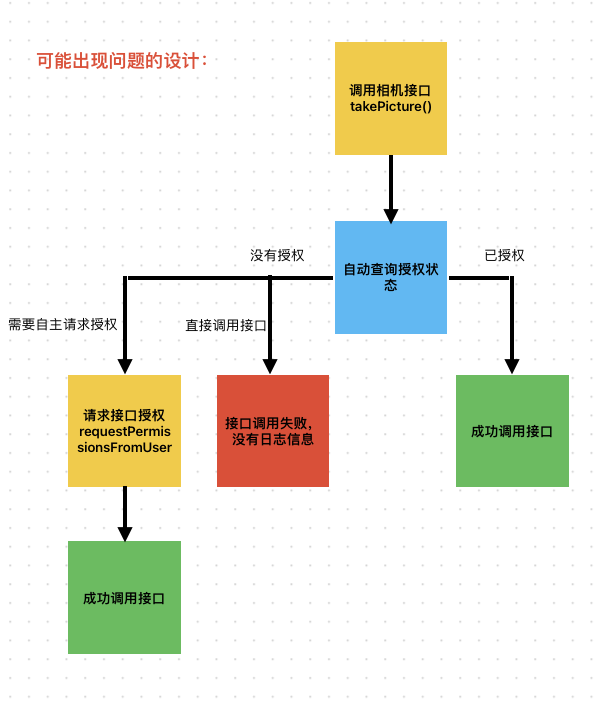
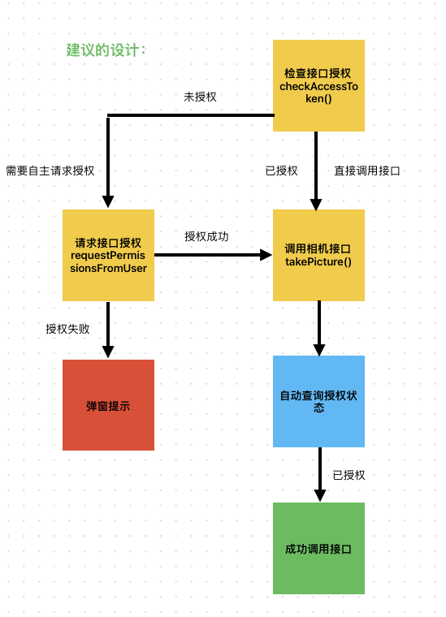
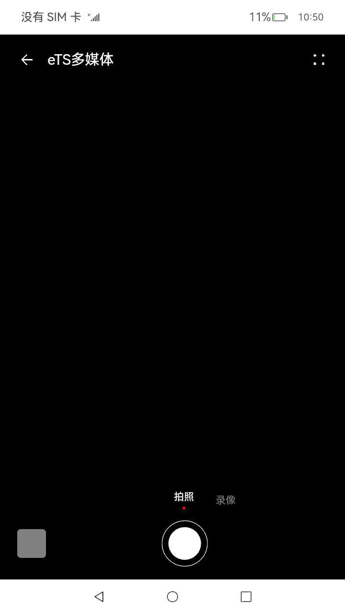
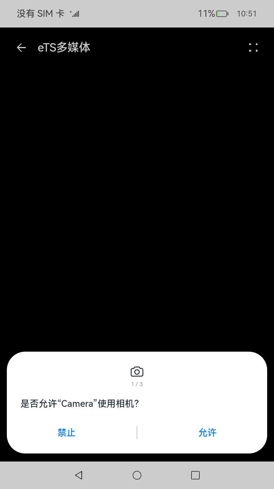
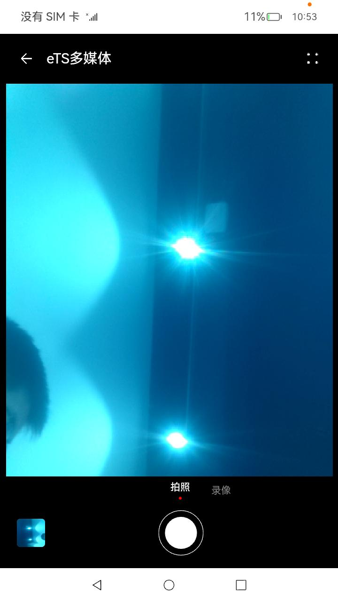

# 相机开发指导

## 介绍

本指导主要展示了调用相机的调用过程，以及调用相机的权限准备;

本指导对比了两种设计方案优劣，并给出推荐方案；

本指导使用的sample链接🔗：[Camera](https://gitee.com/openharmony/applications_app_samples/tree/master/code/SystemFeature/Media/Camera)

使用了如下接口：
<br>[@ohos.abilityAccessCtrl](https://gitee.com/openharmony/docs/blob/master/zh-cn/application-dev/reference/apis/js-apis-abilityAccessCtrl.md)
<br>[@ohos.multimedia.camera](https://gitee.com/openharmony/docs/blob/master/zh-cn/application-dev/reference/apis/js-apis-camera.md)

## 开发设计

注意事项：请确保已经获取权限后再调用相关接口，否则无法调用成功也不会提示，开发者会浪费时间在检查自己代码上。具体分析如下：

如果像如下流程直接调用接口可能会导致接口不能调用的问题：



所以我们建议开发者使用如下设计：



1. 检查相机授权状态（检查授权状态）
2. 主动请求查相机授权（主动请求授权）
3. 打开相机（调用需要授权的接口）
4. 调用拍照接口

## 开发步骤

1. 导入头文件

```ts
import type { Permissions } from '@ohos.abilityAccessCtrl';
```

2. 查询相机授权状态

```
let atManager = abilityAccessCtrl.createAtManager();
let tokenID = 0; // 系统应用可以通过bundleManager.getApplicationInfo获取,普通应用可以通过bundleManager.getBundleInfoForSelf获取
try {
    atManager.checkAccessToken(tokenID, 'ohos.permission.GRANT_SENSITIVE_PERMISSIONS').then((data) => {
        console.log(`checkAccessToken success, data->${JSON.stringify(data)}`);
    }).catch((err) => {
        console.log(`checkAccessToken fail, err->${JSON.stringify(err)}`);
    });
} catch(err) {
    console.log(`catch err->${JSON.stringify(err)}`);
}
```



3. 获取相机权限

相关完整代码链接：
[PermissionUtils.ets](https://gitee.com/openharmony/applications_app_samples/blob/master/code/SystemFeature/Media/Camera/entry/src/main/ets/utlis/PermissionUtils.ets)

关键代码如下：

```
let atManager = abilityAccessCtrl.createAtManager();
try {
  atManager.requestPermissionsFromUser(this.context, ['ohos.permission.CAMERA'], (err, data)=>{
      console.info('data:' + JSON.stringify(data));
      console.info('data permissions:' + data.permissions);
      console.info('data authResults:' + data.authResults);
  });
} catch(err) {
  console.log(`catch err->${JSON.stringify(err)}`);
}
```



4. 定义一个相机对象

相关完整代码链接：
[CameraModel.ts](https://gitee.com/openharmony/applications_app_samples/blob/master/code/SystemFeature/Media/Camera/entry/src/main/ets/model/CameraModel.ts)

关键代码如下：

```
export default class CameraService {
    private photoOutPut: camera.PhotoOutput = undefined;
}
```

5. 调用拍照接口

相关完整代码链接：
[Camera.ets](https://gitee.com/openharmony/applications_app_samples/blob/master/code/SystemFeature/Media/Camera/entry/src/main/ets/pages/Camera.ets)

关键代码如下：

```
Image(this.getCameraIcon())
  .size({ width: 64, height: 64 })
  .margin({ left: 10 })
  .id('camera')
  .onClick(() => {
    Logger.info(TAG, 'takePicture begin');
    prompt.showToast({ message: '拍照中...', duration: 200 });
    this.cameraModel.takePicture();
  })
```



## 总结

由于相机强关联硬件设备，在开发前要确保硬件设备完整性。其次，相机开发主要关注权限问题，避免因权限问题延长调试时间。此外，还因关注不同设备差异性产生的接口不兼容问题，需要测试覆盖完整。