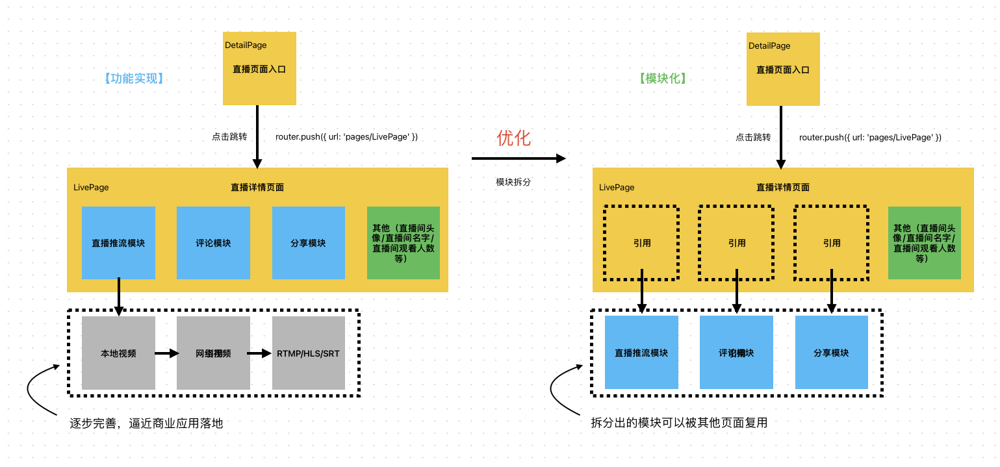
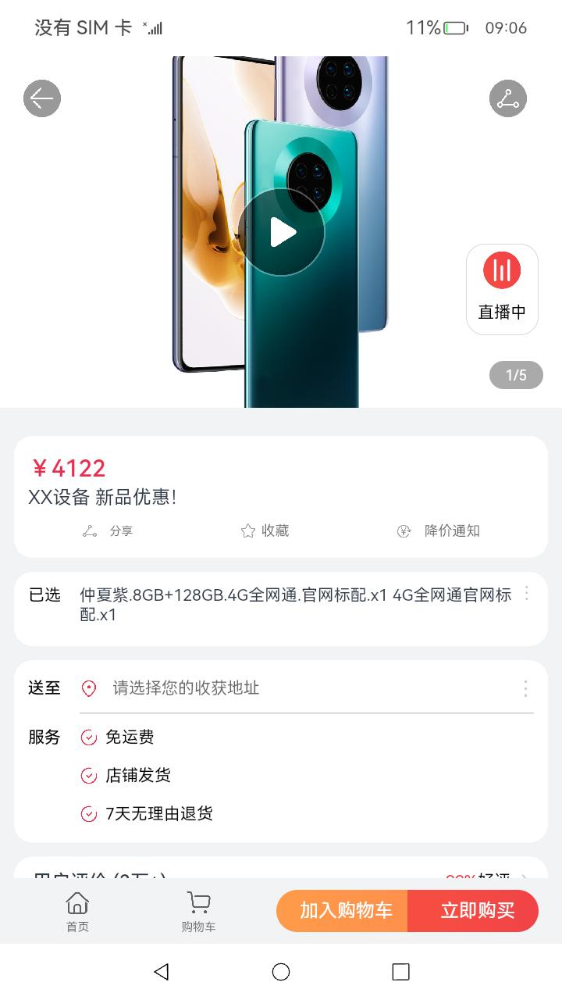
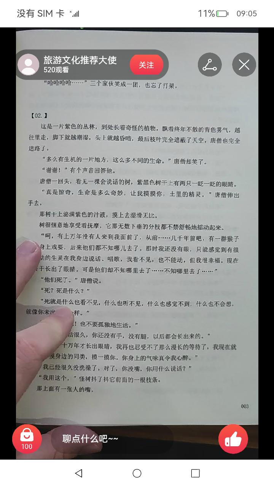

# 开发直播

## 介绍

本示例主要展示了直播场景的设计，直播推流的展示，直播页面其他组件的开发，以及组件设计优化;

本例使用的sample链接🔗：[OrangeShopping](https://gitee.com/openharmony/applications_app_samples/tree/master/code/Solutions/Shopping/OrangeShopping)

依赖的模块链接🔗：[VideoShow](https://gitee.com/openharmony/applications_app_samples/tree/master/code/BasicFeature/Media/VideoShow)

使用了如下接口：
<br>[@ohos.router](https://gitee.com/openharmony/docs/blob/master/zh-cn/application-dev/reference/apis)
<br>[@ohos.mediaquery](https://gitee.com/openharmony/docs/blob/master/zh-cn/application-dev/reference/apis)

## 开发设计

注意事项：

1. 建议先从本地视频调试，待页面开发完毕后，再改为真实推流地址调试。
2. 建议将直播组件拆成模块（因为应用中可能有多处可以进入到直播页面，如首页进入直播页面，详情页进入直播页面……），模块指导文章链接🔗：[har创建和引入]() 
3. 具体开发流程如下：
   可以把开发分成两部分，【功能实现】和【模块化】



## 代码逻辑

1. 通过直播页面入口，点击进入直播
2. 直播详情页面，video组件加载推流链接。
3. 加载直播界面信息栏。（直播间头像/直播间名字/直播间观看人数/关注按钮/分享图标/评论框）
4. 开发直播界面信息具体模块功能。

## 开发步骤

###1. 直播详情入口

相关完整代码链接：
[LivePage.ets](https://gitee.com/openharmony/applications_app_samples/blob/master/code/BasicFeature/Media/VideoShow/entry/src/main/ets/pages/LivePage.ets)

```
import { LivePage } from '@ohos/video-component'

@Entry
@Component
struct Live {
  build() {
    Column() {
      LivePage()
    }
  }
}
```



###2. 直播详情页开发

相关完整代码链接：
[LivePage.ets](https://gitee.com/openharmony/applications_app_samples/blob/master/code/BasicFeature/Media/VideoShow/VideoComponent/src/main/ets/components/pages/LivePage.ets)



#### 直播组件

通过video组件展示直播视频，其中uri可以是本地视频路径，也可以是网络地址。

```
Video({ src: item.uri })
  .autoPlay(true)
  .loop(false)
  .controls(false)
  .width('100%')
  .height('100%')
```

#### 使用本地视频调试

从本地视频调试，待页面开发完毕后，再改为真实推流地址调试。可以提升开发效率，让开发者专注于直播页面开发，避免网络产生的问题，达成一次尽力完成一件事的目标。

相关完整代码链接：
[LiveData.ets](https://gitee.com/openharmony/applications_app_samples/blob/master/code/BasicFeature/Media/VideoShow/VideoComponent/src/main/ets/components/mock/LiveData.ets)

关键代码如下：

```
export const LiveData: Array<LiveInfoDataModel> = [
  { "uri": $rawfile('video_1.mp4'),
    "name": $r("app.string.first_author"),
    "peopleNum": "520",
    "commentList": [
      {
        "name": $r("app.string.first_one_name"),
        "comment": $r("app.string.first_one_comment")
      },
    ]
  }
```

#### 直播界面信息栏开发

开发直播界面信息页面，直播页面往往不只有直播，还有其他附属功能，比如（直播间头像/直播间名字/直播间观看人数/关注按钮/分享图标/评论框）

相关完整代码链接：
[LivePage.ets](https://gitee.com/openharmony/applications_app_samples/blob/master/code/BasicFeature/Media/VideoShow/entry/src/main/ets/pages/LivePage.ets)

关键代码如下：

```
  build() {
    Scroll() {
      Column() {
        Swiper() {
          ForEach(this.liveInfoList, (item, index) => {
            Stack() {
              // 直播界面信息栏
              Row() {
                // 信息栏左边信息
                Row() {
                  Row() {
                    Image($r('app.media.live_author')) // 直播间头像
                      .width(38).height(38)

                    Column() {
                      Text(item.name) // 直播间名字
                        .fontSize(16)
                        .fontColor('#ffffff')
                      Row() {
                        Text(item.peopleNum) // 直播间观看人数
                          .id(item.peopleNum)
                          .fontSize(12)
                          .fontColor('#ffffff')
                        Text($r('app.string.watch'))
                          .fontSize(12)
                          .fontColor('#ffffff')
                      }
                    }
                    .alignItems(HorizontalAlign.Start)
                    .padding({ left: '3%' })
                  }

                  Image($r('app.media.live_attention')) // 关注按钮
                    .height(35)
                    .width(59)
                }
                .justifyContent(FlexAlign.SpaceBetween)
                .padding({ left: this.isPhone ? '2%' : '1%', right: this.isPhone ? '2%' : '1%' })
                .width(this.isPhone ? '57.2%' : '30%')
                .aspectRatio(this.isPhone ? 5.15 : 7)
                .backgroundColor('rgba(0,0,0,0.40)')
                .borderRadius(this.isPhone ? 26 : 36)

                // 右边信息栏
                Column() {
                  Image($r('app.media.live_share')) // 分享图标
                    .width(42).height(42)
                }
                .margin({ left: this.isPhone ? '12%' : '49%' })

                Column() {
                  Image($r('app.media.live_close')) // 关闭图标
                    .id('close')
                    .width(42).height(42)
                    .onClick(() => {
                      router.back()
                    })
                }
                .margin({ left: '4%' })
              }
              .position({ x: '4.4%', y: '5.1%' })

              // 评论框
              Column() {
                if (this.active === index) {
                  CommentPage({ activeItem: $active })
                }
              }
              .position({ x: '4.4%', y: this.isPhone ? '72%' : '62%' })
            }
            .backgroundColor('#D8D8D8')
            .width('100%')
            .height('100%')
          })
        }
        .width('100%')
        .height('100%')
        .loop(false)
        .indicator(false)
        .vertical(true)
        .onChange((index: number) => {
          this.active = index
        })
      }
    }
  }
}
```

#### 开发直播界面信息具体模块功能

开发（直播间头像/直播间名字/直播间观看人数/关注按钮/分享图标/评论框）等组件。

你可以将所有模块直接开发到直播页面中，也可以将其他功能组件拆成模块（模块指导文章链接🔗：[har创建和引入]() ），然后集成到直播页面中。

建议将其他功能组件拆成模块（因为应用中可能有多处可能用到，比如评论/点赞等模块会在多个页面用到）

## 总结

直播页面比较复杂，往往可能开发周期较长，甚至需要多人协同开发，所以前期架构规划非常重要，模块化的思想可以提升代码维护性，扩展性，以及强健性，所以开发前的需求评审，代码设计评审非常值得投入时间，提前发现问题，避免开发中途产生的问题导致项目延期。