# 三方包打包和引入

## 前言

三方包的使用在开发中非常常见，比如引用已封装好的包，或者使用和发布自己编写的包。Haromony工程采用自研工具**ohpm**(Open Harmony Package Manager) 作为包管理和发布的标准，关于ohpm的详细介绍，将在后续系列的文章里讲解，本章还是重点关注三方包的内容。
<br>
本文采用的示例较为简单，主要目的是让初学者快速学习了解三方包的基本知识。
<br>
关于本地Har包依赖更详细全面的使用可以参考链接[橘子购物示例](https://gitee.com/openharmony/applications_app_samples/tree/master/code/Solutions/Shopping/OrangeShopping)

## 基本概念介绍和对比

| 名称                           | 基本概念                                       | 业务要求                                                           |
|:---------------------------- |:------------------------------------------ |:-------------------------------------------------------------- |
| HAP(Harmony Ability Package) | 应用安装和更新的最小单元                               | 必须包含UIAbility或者ExtensionAbility<br>可以在设备上独立安装<br>可以包含资源        |
| HAR(Harmony Archive)         | 静态共享包，编译态复用<br>代码和资源跟随使用编译，有多个使用方，会有多份相同拷贝 | 不包含UIAbility或者ExtensionAbility<br>不支持独立安装<br>可以发布到中心仓或者私仓供他人使用 |
| HSP(Harmony Shared Package)  | 动态共享包 运行时复用<br>代码资源独立编译，有多个使用方也只会存在一份代码    | 不包含UIAbility或者ExtensionAbility<br>不支持独立安装<br>                  |

> 关于表格里的名词,这里做简单的介绍
> 
> > UIAbility  是系统调度的基本单元，一个应用可以包含多个UIAbility。每一个UIAbility在都会在任务列表中显示一个对应的任务。就是一个具备UI展示能力的应用组件。
> > ExtensionAbility 是特定场景下提供的应用组件，类型多样，目前有九种类型。例：FORM类型的ExtensionAbility组件，用于提供服务卡片场景相关能力

<br>

**Har包的使用场景最广泛，我们重点讲一下本地依赖har包的场景**

## 场景一 依赖本地Har模块

### 1. 创建工程

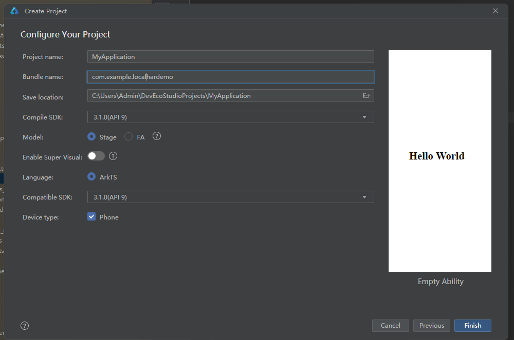

### 2. 新建模块

创建完后可以选择直接右键新建模块;也可以创建新目录，再右键目录创建模块，这里选择直接在根目录下创建模块
<br>
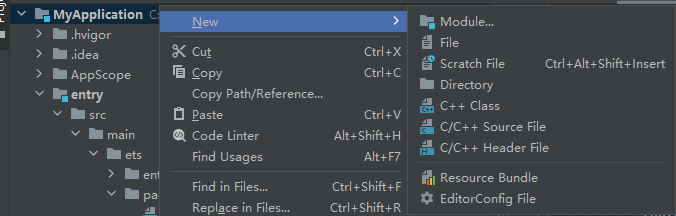
<br>
模块类型选择static library
<br>
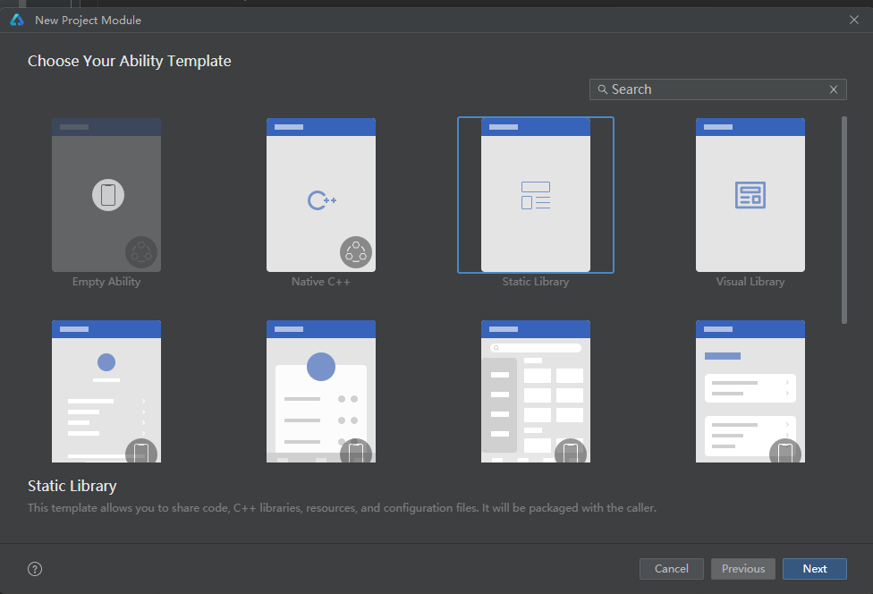

 创建完后可以打开***localHar/src/main/module.json5*** 文件 ，里面的type是har

```
{
  "module": {
    "name": "localHar",
    "type": "har",
    "deviceTypes": [
      "default"
    ]
  }
}
```

**module.json5 字段说明**
|字段名称|字段说明|备注|
|:----|:----|:----|
|name|模块名称|就是新建的模块名称|
|type|模块类型|entry feature 对应构建产物的是Hap，share 是Hsp, har 是Har|
|deviceTypes|适配设备|default：能够使用全部系统能力的OpenHarmony设备。枚举还包括phone,tv,tablet|

再看一下 ***localHar/index.ets***

```
export { MainPage } from './src/main/ets/components/mainpage/MainPage'
```

这个文件是整个模块的入口，具体的入口配置在 ***localHar/oh-package.json5***

```
{
  "name": "localhar",
  "version": "1.0.0",
  "description": "Please describe the basic information.",
  "main": "index.ets",
  "author": "",
  "license": "Apache-2.0",
  "dependencies": {}
}
```

### 3. 修改配置和文件

在***entry/oh-package.json5***里设置依赖关系（和npm的配置文件package.json十分相似）

```
{
  "name": "entry",
  "version": "1.0.0",
  "description": "Please describe the basic information.",
  "main": "",
  "author": "",
  "license": "ISC",
  "dependencies": {
    "@ohos/localHar": "file:../localHar"
  }
}
```

**oh-package.json5 字段说明**
|字段名称|字段说明|备注|
|:----|:----|:----|
|name|名称|Har包的名称尽量使用@group/packagename group是当前开发的组织 例：@ohos/shoppingDetail|
|version|版本号|符合semver语义化规范 例：1.0.0|
|main|入口|指定的加载入口文件|
|author|作者|里面可以设置作者name信息和email信息|
|description|简介|描述包信息的字符串|
|repository|仓库地址|当前包所在的开源仓库地址|
|license|开源协议|当前项目的开源许可证|
|dependencies|生产依赖|项目运行所依赖的模块，即项目生产环境下需要用到的依赖|
|devDependencies|开发依赖|项目开发所依赖的模块|

添加依赖后会发现出现红色报错提示
<br>
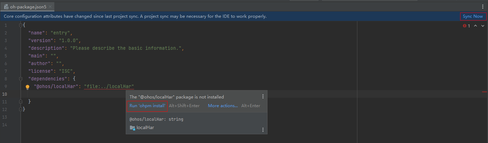
<br>
这时候可以点击右上角的Sync Now，会自动检查依赖下载情况。或者鼠标移动到报错代码部分，点击出现的ohpm install. 就会自动下载对应的依赖了。安装完毕后，entry下出现oh_module，里面就是下载的依赖，这里的依赖其实是个软链接，通过快捷方式跳转。
<br>
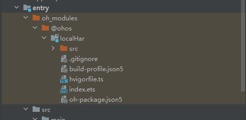
<br>
此时就可以在entry里使用localHar的组件了
打开***localHar/src/main/ets/components/mainpage/MainPage.ets*** 修改后代码如下

```
@Component
export struct MainPage {
  @State message: string = 'Hello LocalHar'

  build() {
    Row() {
      Column() {
        Text(this.message)
          .fontSize(50)
          .fontWeight(FontWeight.Bold)
      }
      .width('100%')
    }
    .height('100%')
  }
}
```

打开***entry/src/main/ets/pages/Index.ets*** 修改后代码如下

```
import {MainPage} from "@ohos/localHar"

@Entry
@Component
struct Index {

  build() {
    Row() {
      MainPage()
    }
    .height('100%')
  }
}
```

### 4. 运行验证

<br>
右上角绿色小三角构建entry后运行，开发板展示如下

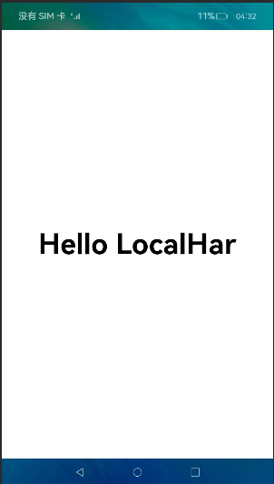

## 场景二 依赖外部构建好的HAr包

整个工程的构建不会自动把里面Har类型的模块打成Har包，可以在***localHar/build***里查看一下,我们这里把内部的localHar打成Har包，通过直接操作生成的Har包来模拟引用外部Har
<br>

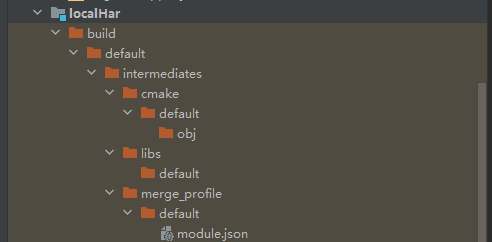
<br>
所以需要我们自己手动去打Har。打包之前我们修改一下***localHar/src/main/ets/components/mainpage/MainPage.ets***文本内容，方便区分是否生效
<br>

### 1. 修改UI展示

```
@Component
export struct MainPage {
  @State message: string = 'Hello LibHar'

  build() {
    Row() {
      Column() {
        Text(this.message)
          .fontSize(50)
          .fontWeight(FontWeight.Bold)
      }
      .width('100%')
    }
    .height('100%')
  }
}
```

### 2.模块打包

首先左键选中要构建的模块
<br>
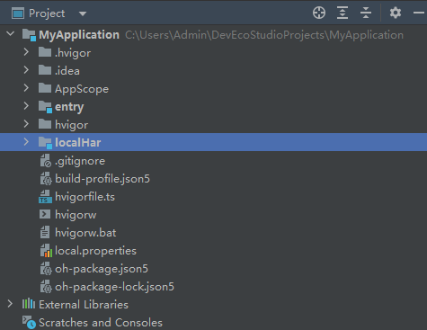
<br>
然后上方的build菜单栏里点击build Module 'localHar'
<br>
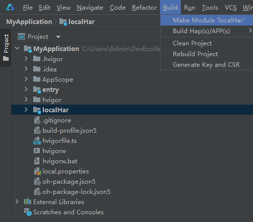
<br>
然后就可以看到打出的har包了
<br>
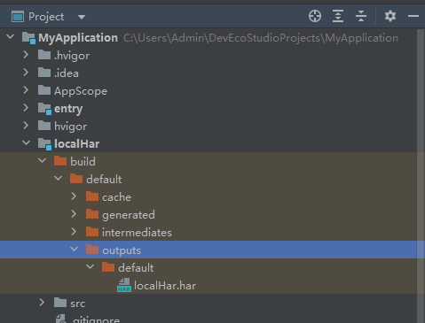
<br>
我们将生成的Har包放到工程的单独文件夹里,右键工程根目录，新建directory
<br>
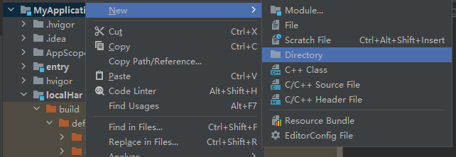
<br>
文件夹名字没有要求，这里用lib,表明是外部的包，然后我用手动拖拽的方式将之前打好的Har包移动到libs文件夹下,在弹框中点击refactor确认
<br>
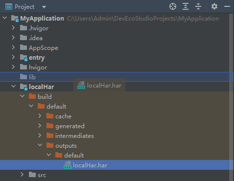
<br>
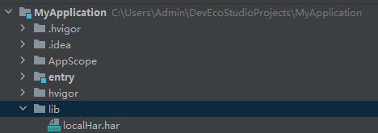
<br>
移动后，原先的模块就可以不用了,我们去改一下***entry/oh-package.json5***

```
{
  "license": "ISC",
  "devDependencies": {},
  "author": "",
  "name": "entry",
  "description": "Please describe the basic information.",
  "main": "",
  "version": "1.0.0",
  "dependencies": {
    "@ohos/localHar": "file:../lib/localHar.har"
  }
}
```

### 3. 运行验证

然后再运行，这里为了防止干扰，可以先手动清理一下之前的构建产物
<br>
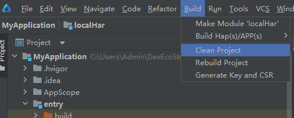
<br>
然后运行效果如图
<br>


## 场景三 从ohpm公仓上引入三方包

可以直接参考根目录下的***oh-package.json5***

```
{
  "license": "",
  "devDependencies": {
    "@ohos/hypium": "1.0.6"
  },
  "author": "",
  "name": "myapplication",
  "description": "Please describe the basic information.",
  "main": "",
  "version": "1.0.0",
  "dependencies": {}
}
```

里面引入了框架提供的hypium，三方包的引入方式和这个类似，我们可以去三方包的网站上去寻找自己需要的三方包
[ohpm三方包仓库](https://ohpm.openharmony.cn/#/cn/home)
<br>
我们引入这个二维码相关的三方库进行开发
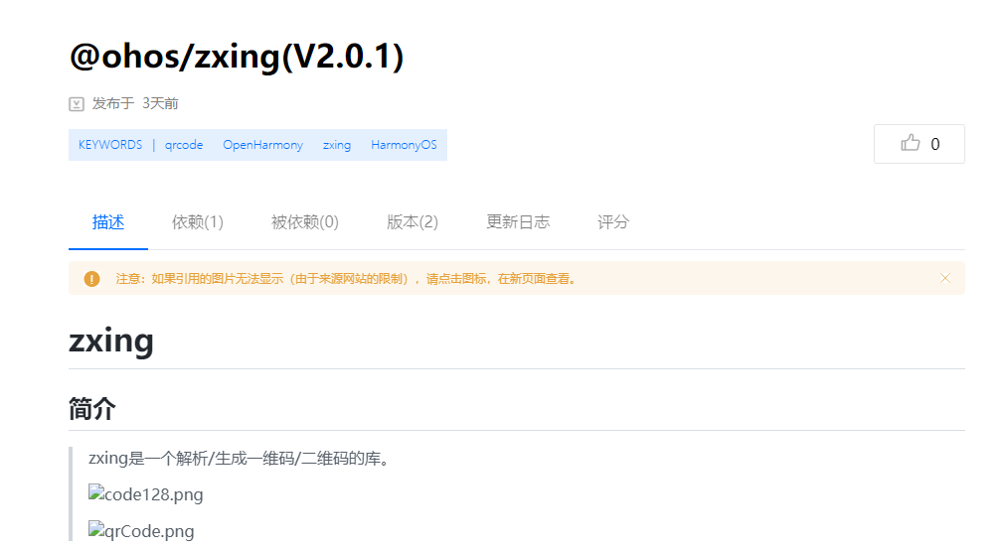
<br>
修改***entry/oh-package.json5***

```
{
  "license": "ISC",
  "devDependencies": {},
  "author": "",
  "name": "entry",
  "description": "Please describe the basic information.",
  "main": "",
  "version": "1.0.0",
  "dependencies": {
    "@ohos/localHar": "file:../lib/localHar.har",
    "@ohos/zxing": "2.0.1"
  }
}
```

然后同步一下，会自动安装相关依赖，安装后就可以使用三方包的功能了，我们在页面里可以直接import我们需要的组件,进行开发

```
import {MainPage} from "@ohos/localHar"
import {MultiFormatReader, BarcodeFormat, DecodeHintType, RGBLuminanceSource, BinaryBitmap, HybridBinarizer } from "@ohos/zxing";
@Entry
@Component
struct Index {
  build() {
    Row() {
      MainPage()
    }
    .height('100%')
  }
}
```

注意：本文中未涉及三方包发布讲解，是因为笔者认为发布和ohpm工具更贴合，所以会在后面出专门的ohpm文章讲解该部分 

## 参考资料

[ohpm三方包仓库](https://ohpm.openharmony.cn/#/cn/home)

[橘子购物示例](https://gitee.com/openharmony/applications_app_samples/tree/master/code/Solutions/Shopping/OrangeShopping)

[stage模型module.json5文件介绍](https://docs.openharmony.cn/pages/v4.0/zh-cn/application-dev/quick-start/module-configuration-file.md/)

[共享包概述](https://docs.openharmony.cn/pages/v4.0/zh-cn/application-dev/quick-start/shared-guide.md/)