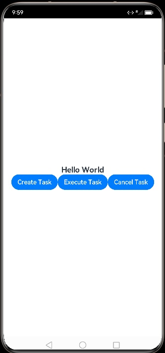

<p align="center">
  <h1 align="center">OpenHarmony使用线程池TaskPool开发多线程任务</h1>
</p>

## 概念介绍

任务池（taskpool）为应用程序提供一个多线程的运行环境，可以使用任务池API创建后台任务（Task），并对所创建的任务进行如任务执行、任务取消的操作。使用任务池，无需关心线程实例的生命周期，提升开发体验，还能降低整体资源的消耗、提高系统的整体性能。
## API接口

任务池模块提供的功能非常基础，只支持任务构造，任务执行，任务取消等3类接口。关于任务池（taskpool）API能力详细信息，请参考[@ohos.taskpool](https://docs.openharmony.cn/pages/v3.2/zh-cn/application-dev/reference/apis/js-apis-taskpool.md)。本节只进行关键接口解读。

### Task构造函数

使用线程池运行后台任务前，可以先构造一个Task实例。Task构造函数如下：

```javascript
constructor(func: Function, …args: unknown[])

```

**其中，参数解释：**

| 参数名 | 类型      | 必填 | 说明                                                                  |
| ------ | --------- | ---- | -------------------------------------------------------------------- |
| func   | Function  | 是   | 任务执行需要传入函数，支持的函数返回值类型请查[序列化支持类型](https://docs.openharmony.cn/pages/v3.2/zh-cn/application-dev/reference/apis/js-apis-taskpool.md/#%E5%BA%8F%E5%88%97%E5%8C%96%E6%94%AF%E6%8C%81%E7%B1%BB%E5%9E%8B)。   |
| args   | unknown[] | 否   | 任务执行传入函数的参数，支持的参数类型请查[序列化支持类型](https://docs.openharmony.cn/pages/v3.2/zh-cn/application-dev/reference/apis/js-apis-taskpool.md/#%E5%BA%8F%E5%88%97%E5%8C%96%E6%94%AF%E6%8C%81%E7%B1%BB%E5%9E%8B)。默认值为undefined。 | 


我们来看一个构造的示例。

```javascript
@Concurrent
function printArgs(args) {
    console.log("printArgs: " + args);
    return args;
}

let task = new taskpool.Task(printArgs, "this is my first Task");

```
> 注意：上述实例代码是官方API提供的，实际上并不可用，使用装饰器@Concurrent会报错。实际上使用的是如下代码：

```javascript
function concurrentTask(durationMs: number) {
  "use concurrent"
  console.info("[concurrentTask] task start, the args is " + durationMs)
  setTimeout(() => {
    console.info("[concurrentTask] task end ")
  }, durationMs)
  console.info("[concurrentTask] task return")
  return '[concurrentTask] returned'
}

function createTask() {
  let task = new taskPool.Task(concurrentTask, 10 * 1000)
  console.info("[createTask] created successfully")
  return task
}
```

### 执行异步函数

将待执行的函数放入taskpool内部任务队列等待，等待分发到工作线程执行。此种方式执行的情况下，没有创建任务，所以不可取消任务。后文将介绍的taskpool.cancel函数需要传入taskpool.Task参数。
接口定义如下，其中的参数不再解释，和Task构造函数的参数一样。

```javascript
execute(func: Function, …args: unknown[]): Promise<unknown>
```

**示例代码如下：**

```javascript
@Concurrent
function printArgs(args) {
    console.log("printArgs: " + args);
    return args;
}

async function taskpoolExecute() {
  let value = await taskpool.execute(printArgs, 100);
  console.log("taskpool result: " + value);
}
...
taskpoolExecute();

```

### 执行Task任务

将创建好的任务放入taskpool任务池里等待，等待分发到工作线程执行。当前执行模式可尝试调用cancel进行任务取消。接口定义如下：

```javascript
execute(task: Task, priority?: Priority): Promise<unknown>

```

**其中，参数如下：**

| 参数名   | 类型                  | 必填 | 说明                                 |
| -------- | --------------------- | ---- | ------------------------------------ |
| task     | [Task](#task)         | 是   | 需要在任务池中执行的任务。           |
| priority | [Priority](#priority) | 否   | 等待执行的任务的优先级（暂未支持）。 |

**示例代码如下：**

```javascript
@Concurrent
function printArgs(args) {
    console.log("printArgs: " + args);
    return args;
}

async function taskpoolExecute() {
  let task = new taskpool.Task(printArgs, 100);
  let value = await taskpool.execute(task);
  console.log("taskpool result: " + value);
}

taskpoolExecute();

```
### 取消Task任务

取消任务池中的任务。在Task构造实例后直接调用cancal接口会找不到要取消的任务，需要调用execute接口后，才会放入任务池，调用cancel接口才有意义。

接口定义如下：

```javascript
cancel(task: Task): void
```

**其中，参数如下：**

| 参数名 | 类型          | 必填 | 说明                 |
| ------ | ------------- | ---- | -------------------- |
| task   | [Task](https://docs.openharmony.cn/pages/v3.2/zh-cn/application-dev/reference/apis/js-apis-taskpool.md/#task) | 是   | 需要取消执行的任务。 |

示例代码如下：

```javascript
@Concurrent
function printArgs(args) {
    console.log("printArgs: " + args);
    return args;
}

async function taskpoolCancel() {
  let task = new taskpool.Task(printArgs, 100);
  taskpool.execute(task);
  try {
    taskpool.cancel(task);
  } catch (e) {
    console.log("taskpool.cancel occur error:" + e);
  }
}

taskpoolCancel();
```

## 实现场景

我们主要为了体验线程池的使用，实现任务创建、任务执行和任务取消的功能。为了简化，相关输出使用console控制输出即可。


## 设计思路

简化界面实现，只需要简单地包含一个text和三个button。text用于展示接口调用信息，不同的button按钮被点击后触发调用不同的接口。通过设置日志查看操作执行情况。

## 开发步骤
<!-- panels:start -->

<!-- div:title-panel -->
### UI界面实现

<!-- div:left-panel -->

代码非常简单，使用DevEco Studio创建一个Empty Ability空工程后，加3个按钮就行。

"Create Task"按钮会创建一个任务。创建的Task实例会赋值给组件的变量，创建任务的代码如下。现在存在一个问题需要确认，@concurrent装饰器不知道如何使用，
当前使用的"use concurrent"。需要确认官方文档是否存在问题。

```javascript
function concurrentTask(durationMs: number) {
  "use concurrent"
  console.info("[concurrentTask] task start, the args is " + durationMs)
  setTimeout(() => {
    console.info("[concurrentTask] task end ")
  }, durationMs)
  console.info("[concurrentTask] task return")
  return '[concurrentTask] returned'
}

function createTask() {
  let task = new taskPool.Task(concurrentTask, 10 * 1000)
  console.info("[createTask] created successfully")
  return task
}
```

"Execute Task"按钮会执行一个任务。组件的变量持有任务，该按钮可以持续点击，反复执行任务。

"Cancel Task"按钮会取消一个任务。如果认为没有调用execute接口，不在线程池里，取消会阿伯错；如果任务正在执行中，再去取消也会报错。实际上运行，没有得到想要的效果，需要进一步确认。

<!-- div:right-panel -->

<!-- tabs:start -->

### **UI代码**
`entry\src\main\ets\pages\Index.ets`文件片段如下：
```javascript
   task: taskPool.Task = null
   ...
  Column() {
	Text(this.message)
	  .fontSize(20)
	  .fontWeight(FontWeight.Bold)
	Blank()
	Row() {
	  Button("Create Task").onClick(() => {
		this.task = createTask()
		this.message = "Task Created"
	  })
	  Button("Execute Task").onClick(() => {
		executeTask(this.task)
		this.message = "Task Executed"
	  })
	  Button("Cancel Task").onClick(() => {
		cancelTask(this.task)
		this.message = "Task Cancel involved"
	  })
	}

  }   
```
### **UI预览**



<!-- tabs:end -->
<!-- panels:end -->
<!-- panels:start -->

<!-- div:title-panel -->
### 执行任务代码实现
<!-- div:left-panel -->

我们再执行任务代码如何实现。

我们从上文知道，taskPool.execute接口有两种方式，可以传入异步函数和参数，也可以传入task实例和优先级参数。

此处，我们使用第二种方法，传入task实例和优先级参数。任务池模块尚未支持优先级，该参数也可以省略。
<!-- div:right-panel -->

执行任务代码片段如下：

```javascript
function executeTask(task: taskPool.Task) {
  console.info("[executeTask] executing")
  try {
    taskPool.execute(task, taskPool.Priority.HIGH).then(() => {
      console.info("[executeTask] executed successfully")
    })
  } catch (e) {
    console.error("[executeTask] execute failed, " + e.toString())
  }
}
```

<!-- panels:end -->
<!-- panels:start -->

<!-- div:title-panel -->
### 取消任务代码实现

<!-- div:left-panel -->

我们再看下取消任务的代码如何实现。

如果没有通过调用execute接口，没有放入任务池的task，执行cancel函数时，会报异常，毕竟在线程池是不存在的。

然后模拟一个延时操作，再去调用cancel函数。

期望可以正常取消任务，实际上，任务没有被取消，也没有报异常。这里就很奇怪，需要继续调查原因。

<!-- div:right-panel -->

取消任务代码片段:
 
```javascript
function cancelTask(task: taskPool.Task) {
  console.info("[cancelTask] canceling ")
  try {
    taskPool.execute(task, taskPool.Priority.HIGH)
    let start = new Date().getTime()
    // 延时1s，确保任务已执行
    while (new Date().getTime() - start < 1000) {
      continue
    }
    taskPool.cancel(task)
  } catch (e) {
    console.error("[cancelTask] cancel failed" + e.toString())
  }
}
```

<!-- panels:end -->

### 运行测试效果

代码编写完毕，可以测试运行查看效果。推荐在模块级配置文件`entry\build-profile.json5`中,修改运行时为"HarmonyOS"，这样就可以在DevEco Studio中使用Simulator模拟器进行运行测试，手头没有设备也可以轻松体验OpenHarmony应用开发。分别点击按钮，日志输出如下:

```shell
07-30 22:28:28.357 4214-7232/com.example.taskpooldemo I 0FEFE/JsApp: [createTask] created successfully
07-30 22:28:30.576 4214-7232/com.example.taskpooldemo I 0FEFE/JsApp: [executeTask] executing
07-30 22:28:30.576 4214-7256/com.example.taskpooldemo I 0FEFE/JsApp: [concurrentTask] task start, the args is 10000
07-30 22:28:30.576 4214-7256/com.example.taskpooldemo I 0FEFE/JsApp: [concurrentTask] task return
07-30 22:28:30.577 4214-7232/com.example.taskpooldemo I 0FEFE/JsApp: [executeTask] executed successfully
07-30 22:28:37.602 4214-7232/com.example.taskpooldemo I 0FEFE/JsApp: [cancelTask] canceling
07-30 22:28:37.608 4214-7256/com.example.taskpooldemo I 0FEFE/JsApp: [concurrentTask] task start, the args is 10000
07-30 22:28:37.609 4214-7256/com.example.taskpooldemo I 0FEFE/JsApp: [concurrentTask] task return
07-30 22:28:38.607 4214-7232/com.example.taskpooldemo E 0FEFE/JsApp: [cancelTask] cancel failedBusinessError: The task does not exist when it is canceled, taskpool:: can not find the task
07-30 22:28:40.580 4214-7256/com.example.taskpooldemo I 0FEFE/JsApp: [concurrentTask] task end
07-30 22:28:47.608 4214-7256/com.example.taskpooldemo I 0FEFE/JsApp: [concurrentTask] task end
```


## 注意事项

理论上，您可以使用任务池API创建数量不受限制的任务。当同一时间待执行的任务数量大于任务池工作线程数量，任务池会根据负载均衡机制进行扩容，增加工作线程数量，减少整体等待时长。同样，当执行的任务数量减少，工作线程数量大于执行任务数量，部分工作线程处于空闲状态，任务池会根据负载均衡机制进行缩容，减少工作线程数量。遗憾的是，负载均衡机制暂未支持。

创建的同一优先级任务的执行顺序可以由您决定，任务真实执行的顺序与您调用任务池API提供的任务执行接口顺序一致。任务默认优先级是taskPool.Priority.MEDIUM。遗憾的是，任务优先级机制暂未支持，可以忽略。

@concurrent装饰器如何使用，需要继续确认。另外，官方文档中提到：仅支持在Stage模型且module的compileMode为esmodule的project中使用taskpool api。compileMode设置为什么看起来并不影响什么，需要进一步确认。

最后，任务池模块现在属于基础版本，接口支持只支持简单的任务执行和取消功能，查询运行状态等接口也不支持。任务一旦执行，不支持取消。不建议您在任务中执行阻塞操作，特别是无限期阻塞操作，长时间的阻塞操作占据工作线程，可能会阻塞其他任务调度，影响您的应用性能。

## 参考资料

[多线程任务 Sample](https://gitee.com/openharmony/applications_app_samples/tree/master/code/LaunguageBaseClassLibrary/ConcurrentModule)

[@ohos.taskpool（启动任务池）](https://docs.openharmony.cn/pages/v3.2/zh-cn/application-dev/reference/apis/js-apis-taskpool.md)

[本文示例代码](https://gitee.com/rtos_yuan/ark-uisample/tree/master/code/TaskPoolDemo)
