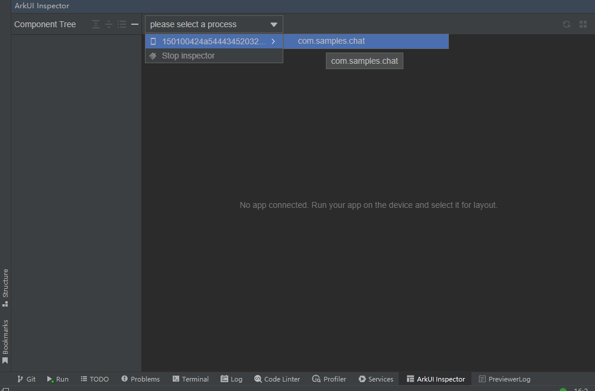
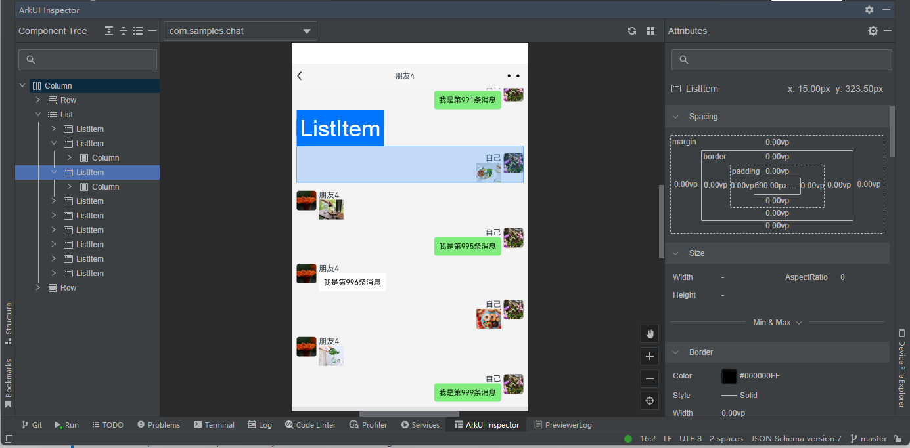
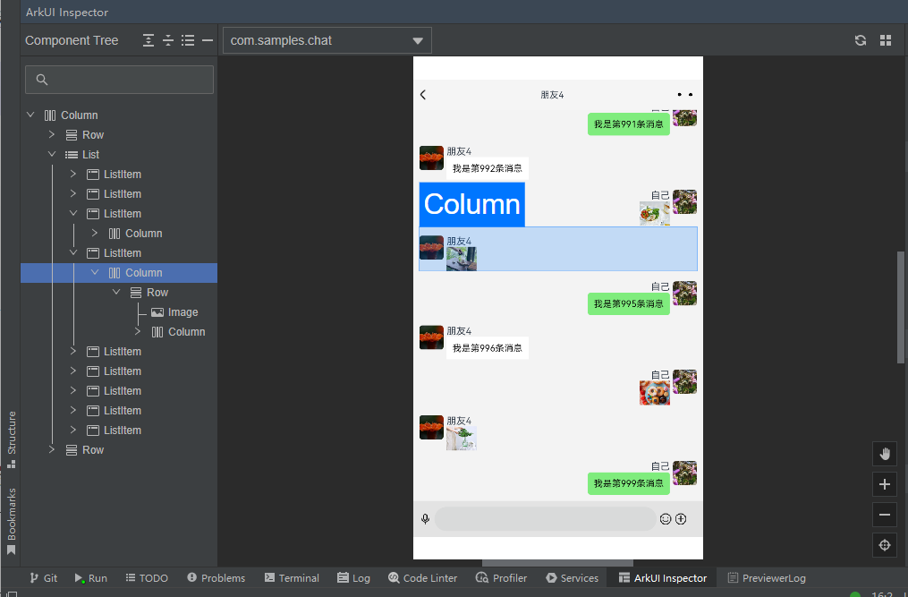
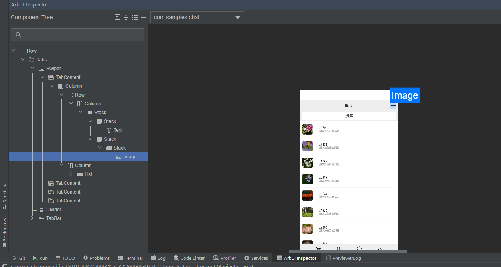

&nbsp;:book: [查看本文案例](https://gitee.com/openharmony/applications_app_samples/tree/master/code/Solutions/IM/Chat)

  <h1 align="center">OpenHarmony使用ArkUI Inspector分析布局</h1>

- 摘要：视图的嵌套层次会影响应用的性能，开发者应该移除多余的嵌套层次，缩短组件刷新耗时。本文会介绍如何使用ArkUI Inspector工具分析布局，提示应用响应性能。

- 关键字：列举本文相关的关键字：OpenHarmony HarmonyOS 鸿蒙 Inspector 布局检查器 视图嵌套

## 概述

应用将布局渲染到屏幕上的流畅度影响用户对质量的感知。建议移除多余的嵌套层次减少视图嵌套层次。视图的嵌套层次会影响应用的性能。因此推荐开发者移除多余的嵌套层次，缩短组件刷新耗时。

如果视图嵌套得很深，会导致花费更多的时间来处理，会增加页面渲染时间。在屏幕刷新率为120Hz的设备上，每8.3ms刷新一帧，如果视图的嵌套层次多，可能会导致没法在8.3ms内完成一次屏幕刷新，就会造成丢帧卡顿，影响用户体验。嵌套视图会创建更多的节点，会增加内存消耗。如果嵌套视图是从服务器获取的，这可能会导致额外的网络延迟，增加页面加载的时间。过多的视图嵌套还可能会使页面的结构和代码变得复杂和难以维护，这可能会导致错误和性能问题的可能性增加。

因此，减少视图嵌套层次非常重要。本文会介绍如何使用ArkUI Inspector工具分析布局，提示应用响应性能。

## 环境准备

从DevEco Studio 4.0 Beta2版本开始集成ArkUI Inspector工具，可以从[OpenHarmony-v4.0-beta2 Release Notes#配套关系](https://gitee.com/openharmony/docs/blob/master/zh-cn/release-notes/OpenHarmony-v4.0-beta2.md#%E9%85%8D%E5%A5%97%E5%85%B3%E7%B3%BB)部分下载DevEco Studio 4.0 Beta2版本。

## 使用场景

开发者可以使用ArkUI Inspector，在DevEco Studio上查看应用在真机上的UI界面显示效果，可以查看查看应用的界面组件树component tree，还可以查看选定组件的属性信息。

在ArkUI Inspector的组件树上选择组件，UI界面自动框选对应组件，属性列表显示当前组件的属性信息。在UI界面点击选择组件，组件树对应组件变化为选中状态，属性列表显示当前组件的属性信息。

ArkUI Inspector工具非常好用。可以使用它分析布局，减少布局嵌套层次，从而提示应用响应性能。

## 工具介绍

使用连接线把真机连接到开发PC，打开DevEco Studio，在 DevEco Studio 下方点击 ArkUI Inspector，打开 ArkUI Inspector。

点击 RUN 或者 DEBUG 按钮，把应用推包到设备上，在设备应用列表选择当前显示在设备前端的 UI 进程。本文使用的是[Sample聊天实例应用](https://gitee.com/openharmony/applications_app_samples/tree/master/code/Solutions/IM/Chat)，需要选择的进程是com.samples.chat。

ArkUI Inspector 左侧为当前的组件树结构Component Tree，中间栏显示当前设备的 UI 显示界面，右侧在选中组件的情况下为当前组件的属性信息。当设备上 UI 发生变化时，可点击中间栏右上角刷新按钮同步设备上的 UI 效果。可以在左侧组件树上选择或直接在 UI 界面点击选择组件。

如果想退出使用ArkUI Inspector，可以在设备框，点击设备列表的最后一项 Stop inspector，可断开与设备的连接。

## 性能实践

我们以一个实际案例来看下如何借助ArkUI Inspector工具来优化布局。

检出工程[Sample聊天实例应用](https://gitee.com/openharmony/applications_app_samples/tree/master/code/Solutions/IM/Chat)工程代码，使用DevEco Studio编译构建，推送到开发板上运行。

我们选择一个简化的场景，打开和一位朋友的聊天窗口，查看历史聊天信息。刷新ArkUI Inspector工具中的UI界面，如下：

可以看出，ListItem列表项中包含一个Column->Row，下面又包含Row和Column子组件。ListItem列表项下的子组件Column这个列容器只包含一个Row子组件容器，Column列容器是不必要的，可以去掉，这样ListItem列表项下的子组件直接为Row子组件即可，从而减少一个视图嵌套层次。一个嵌套层次的影响，可能对性能的影响微乎其微。本实践仅限于用来演示如何使用ArkUI Inspector工具来优化布局。

再看一个例子，在真机上打开[Sample聊天实例应用](https://gitee.com/openharmony/applications_app_samples/tree/master/code/Solutions/IM/Chat)的聊天联系人页面，使用ArkUI Inspector工具刷新下UI界面。看左侧的组件树，可以查看组件的嵌套层次，最大有10层嵌套，就可以考虑小是否可以减少嵌套层次。比如，最顶层的Row组件是可以减少的，其他组件也可以类似查看是否必要，没有最优只有更优。

## 注意事项

> 1、ArkUI Inspector仅支持OpenHarmony API 9 及以上版本的 Stage 工程
> 
> 2、需要使用 debug模式编译。
> 
> 3、已通过 USB 连接设备。
> 
> 4、使用DevEco Studio 4.0 Beta2及以上的版本。

## 参考资料

[[1] Sample聊天实例应用](https://gitee.com/openharmony/applications_app_samples/tree/master/code/Solutions/IM/Chat)。

[[2] 减少视图嵌套层次](https://gitee.com/openharmony/docs/blob/master/zh-cn/application-dev/performance/reduce-frame-loss-and-frame-freezing/reduce-view-nesting-levels.md)

[[3] OpenHarmony-v4.0-beta2 Release Notes](https://gitee.com/openharmony/docs/blob/master/zh-cn/release-notes/OpenHarmony-v4.0-beta2.md)

