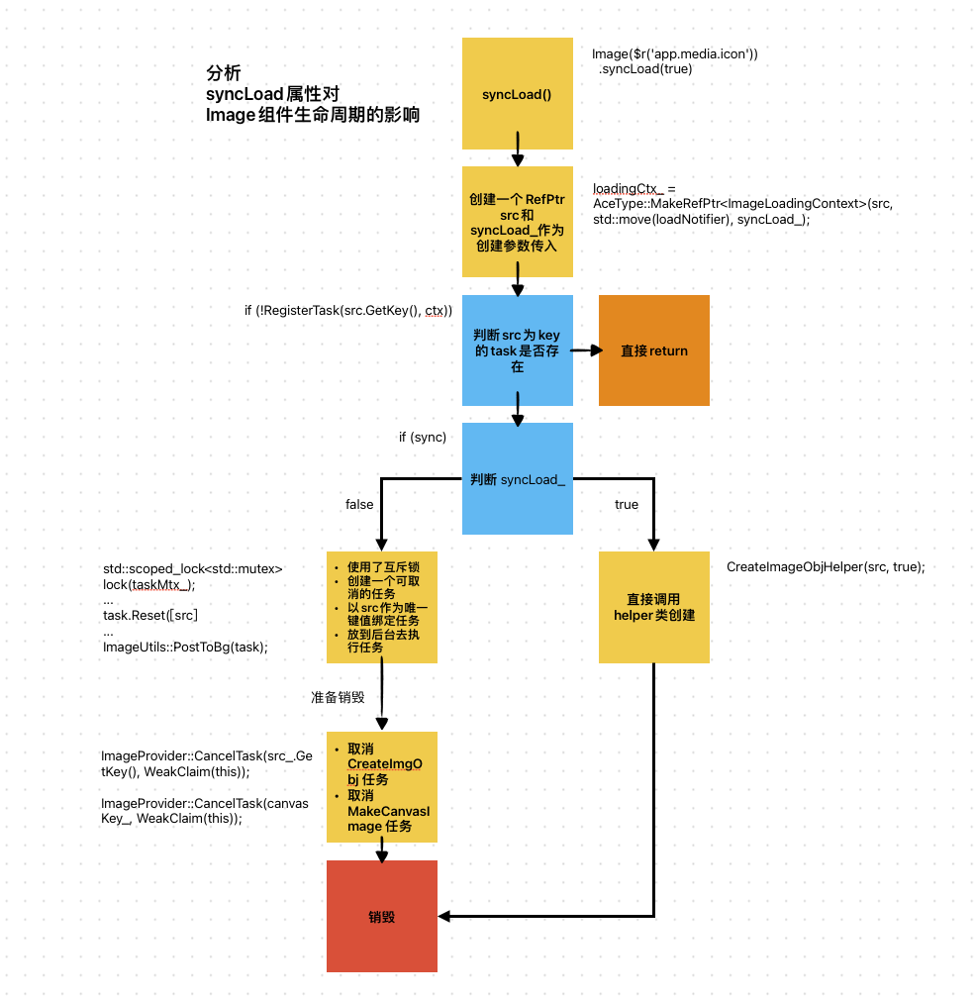

&nbsp;:book: [查看本文案例](https://gitee.com/openharmony/applications_app_samples/tree/master/code/Solutions/IM/Chat)

<p align="center">
  <h1 align="center">OpenHarmony列表场景性能提升方法</h1>
</p>

- 摘要：列表场景在应用程序中很常见，列表性能非常影响用户体验。本文会介绍开发OpenHarmony列表页面时需要考虑的性能提升方法。

- 关键字：OpenHarmony HarmonyOS 鸿蒙 懒加载 列表滑动性能 LazyForEach cachedCount IDataSource

## 概述

列表场景在应用程序中很常见，比如新闻列表，通讯软件消息列表，联系人列表，排行榜，各种账单等。列表性能非常影响用户体验，优化列表性能可以提升用户交互体验。在开发OpenHarmony应用时，常用优化列表性能的方法包含：

- 懒加载

	懒加载在需要数据时才加载数据。如果一次性加载所有的列表数据，一方面会导致页面启动时间过长，影响用户体验，另一方面也会增加
	服务器的压力和流量，加重系统负担。数据懒加载可以从数据源中按需迭代加载数据并创建相应组件。

- 缓存列表项

	缓存已经渲染过的列表项可以减少重复渲染的开销。另外，通过把屏幕外列表项预先加载缓存起来，这样也可以提升列表响应速度。

- 优化页面布局

	优化渲染布局可以减少不必要的渲染绘制操作，提升列表的流畅度。在优化页面布局时，需要减少视图嵌套层次，移除不必要的组件，保持页面精简。

- 优化图片加载

	在列表中包含图片时，优化图片加载可以提高列表的加载速度和流畅度。如果是小图片可以同步下载，避免列表快速滑动时产生图片白块。

- 组件复用

	有些场景下的自定义组件具有相同的组件布局结构，仅有状态变量等承载数据的差异。把这样的组件缓存起来，需要使用到该组件时直接复用，减少重复创建和渲染的时间，从而提高应用页面的加载速度和响应速度。

本文会以一个范例应用来介绍开发OpenHarmony列表页面时，如何使用上述方法来提升列表性能。

## 环境准备

本文会基于[Sample聊天实例应用](https://gitee.com/openharmony/applications_app_samples/tree/master/code/Solutions/IM/Chat)进行讲解，该示例应用
是一个仿聊天类应用，使用了静态布局搭建了不同的页面。为了优化内存与性能体验，在部分列表场景使用了懒加载。除了懒加载，本文还会尝试其他性能优化方法。

## 性能实践

### 懒加载

开发者在使用长列表时，如果直接采用循环渲染方式，会一次性加载所有的列表元素，会导致页面启动时间过长，影响用户体验。建议开发者使用数据懒加载，从数据源中按需迭代加载数据并创建相应组件。


在使用数据懒加载之前，需要实现懒加载数据源接口`IDataSource`，该接口定义在OpenHarmony SDK的接口声明文件[ets\component\lazy_for_each.d.ts](https://gitee.com/openharmony/interface_sdk-js/blob/master/api/@internal/component/ets/lazy_for_each.d.ts)里。
还需要为数据源注册数据变更监听器`DataChangeListener`，在数据变更时调用相应的回调函数。[Sample聊天实例应用](https://gitee.com/openharmony/applications_app_samples/tree/master/code/Solutions/IM/Chat)中，并没有使用到数据变更监视器。[数据源类BasicDataSource.ets](https://gitee.com/openharmony/applications_app_samples/blob/master/code/Solutions/IM/Chat/entry/src/main/ets/common/BasicDataSource.ets)定义如下，该类是一个abstract抽象类，每个列表的数据源具体实现类可以继承实现该抽象类。

```javascript
export abstract class BasicDataSource implements IDataSource {
  private listeners: DataChangeListener[] = []

  public abstract totalCount()

  public getData(index: number): any {
    return undefined
  }

  registerDataChangeListener(listener: DataChangeListener): void {
    if (this.listeners.indexOf(listener) < 0) {
      this.listeners.push(listener)
    }
  }

  unregisterDataChangeListener(listener: DataChangeListener): void {
    const pos = this.listeners.indexOf(listener)
    if (pos >= 0) {
      this.listeners.splice(pos, 1)
    }
  }

  notifyDataReload(): void {
    this.listeners.forEach(listener => {
      listener.onDataReloaded()
    })
  }
	......
}
```

以聊天列表为例，数据源具体类`ChatListData`实现如下，其中[ChatModel类](https://gitee.com/openharmony/applications_app_samples/blob/master/code/Solutions/IM/Chat/entry/src/main/ets/common/MsgBase.ets)对应
聊天列表中列表项，包含用户名、最后一条消息内容，时间戳等信息。数据源类`ChatListData`中，`getData()`方法为数据源接口`IDataSource`中定义的，用于给`LazyForEach`提供数据；`addData()`和`pushData()`为数据源类中定义的方法，可用于给数据源增加数据。[Sample聊天实例应用](https://gitee.com/openharmony/applications_app_samples/tree/master/code/Solutions/IM/Chat)中，使用的模拟数据，并没有从网络上获取，这些增加数据的接口实际上未使用，仅用于后续扩展。

```javascript
class ChatListData extends BasicDataSource {
  private chatList: Array<ChatModel> = []

  public totalCount(): number {
    return this.chatList.length
  }

  public getData(index: number): any {
    return this.chatList[index]
  }

  public addData(index: number, data: ChatModel): void {
    this.chatList.splice(index, 0, data)
    this.notifyDataAdd(index)
  }

  public pushData(data: ChatModel): void {
    this.chatList.push(data)
    this.notifyDataAdd(this.chatList.length - 1)
  }
}
```

最后看下列表页面的代码，详细代码见文件[ChatListPage.ets](https://gitee.com/openharmony/applications_app_samples/blob/master/code/Solutions/IM/Chat/entry/src/main/ets/pages/ChatListPage.ets)。

可以看出，在`List`组件容器中，使用`LazyForEach`循环生成`ListItem`列表项，按屏幕展示需要逐次加载所需的数据，实现了懒加载。如果使用`ForEach`循环会一次性加载所有的数据。

```javascript
 build() {
    Column() {
      List() {
		......
        LazyForEach(this.chatListData, (msg: ChatModel) => {
          ListItem() {
            ChatView({ chatItem: msg, wantParams: this.wantParams, wantFileParams: this.wantFileParams })
          }
        }, (msg: ChatModel) => msg.user.userId)
      }
      .backgroundColor(Color.White)
      .listDirection(Axis.Vertical)
		......
    }
  }
```

### 缓存列表项

在OpenHarmony SDK文件[list.d.ts](https://gitee.com/openharmony/interface_sdk-js/blob/master/api/@internal/component/ets/list.d.ts)中，`ListAttribute`列表属性类中定义了一个`cachedCount`属性。

该属性`cachedCount`用于设置长列表延迟懒加载时列表项`ListItem`的最少缓存数量，表示屏幕外`List/Grid`预加载项的个数。

应用通过增大`List`控件的`cachedCount`参数，调整UI界面的加载范围。如果需要请求网络图片，可以在列表项滑动到屏幕显示之前，提前下载好内容，从而减少滑动白块。

在[Sample聊天实例应用](https://gitee.com/openharmony/applications_app_samples/tree/master/code/Solutions/IM/Chat)中，并未使能该属性，可以尝试使能该属性。缓存列表项数量，建议设置为当前列表页面屏幕可以展示列表项的2倍，具体设置根据列表页面实际情况进行酌情设置。

如下是使用`cachedCount`参数的例子，我们设置为缓存20条列表项。当设置`cachedCount`，可以通过在数据源实现类`getData()`方法中，添加日志打印来验证。当列表界面滑动时，除了获取屏幕上展示的数据，还会额外获取20条列表项数据缓存起来。

```javascript
 build() {
    Column() {
      List() {
		......
        LazyForEach(this.chatListData, (msg: ChatModel) => {
          ListItem() {
            ChatView({ chatItem: msg, wantParams: this.wantParams, wantFileParams: this.wantFileParams })
          }
        }, (msg: ChatModel) => msg.user.userId)
      }
      .backgroundColor(Color.White)
      .listDirection(Axis.Vertical)
		......
	  .cachedCount(20)
    }
  }
```

### 优化渲染布局

在OpenHarmony应用开发时，使用ArkUI Inspector分析列表的界面布局。减少嵌套层次，移除不必要的组件来提升页面响应性能。
可以参考文章[《OpenHarmony使用ArkUI Inspector分析布局》](perf_01_inspector.md)了解更多。

### 优化图片加载

分析下`Image`组件的图片加载流程，如下图。`syncLoad`属性默认为`false`，创建图片时创建一个异步任务，并使用互斥锁。异步加载图片可以避免阻塞主线程，影响UI交互，适合图片加载较长时间时使用。异步任务和使用互斥锁也是有开销的，也可能会影响内存和性能，需要根据实际业务情况进行设置。




在列表场景下，快速滑动时，图片刷新会出现闪烁， 这时可以设置`syncLoad`属性为`true`，使图片同步加载，从而避免出现闪烁，可以解决快速滑动时产生的图片白块。

```javascript
  build() {
		......
        Row() {
          Row() {
            Image(this.chatItem.user.userImage)
			      ......
            .syncLoad(true)
          }
			......
      }
	......
  }
```

### 组件复用

在OpenHarmony应用开发时，自定义组件被`@Reusable`装饰器修饰时表示该自定义组件可以复用。在父自定义组件下创建的可复用组件从组件树上移除后，会被加入父自定义组件的可复用节点缓存里。
在父自定义组件再次创建可复用组件时，会通过更新可复用组件的方式，从缓存快速创建可复用组件。

使用装饰器@Reusable标记一个组件属于可复用组件后，还需要实现组件复用声明周期回调函数`aboutToReuse`，其参数为可复用组件的状态变量。调用可复用自定义组件时，父组件会给子组件传递构造数据。
示例代码如下所示：

```javascript
@Reusable
@Component
struct ReusableChatView {
  @State chatItem: ChatModel = undefined

  aboutToReuse(params) {
    this.chatItem = params.chatItem
  }

  build() {
    ChatView({ chatItem: this.chatItem })
  }
}
```

## 注意事项

> 如果需要验证列表滑动时，列表项中组件的挂载卸载，是否在屏幕上展示，可以调用组件的onAppear、onDisAppear事件。


## 总结

本文基于[Sample聊天实例应用](https://gitee.com/openharmony/applications_app_samples/tree/master/code/Solutions/IM/Chat)中的聊天列表场景，分析了列表滑动性能的优化方法，包含懒加载、
缓存列表项、小图片的同步加载，以及页面布局优化等。

## 参考资料

[[1] Sample聊天实例应用](https://gitee.com/openharmony/applications_app_samples/tree/master/code/Solutions/IM/Chat)

[[2] 性能提升的推荐方法](https://docs.openharmony.cn/pages/v4.0/zh-cn/application-dev/ui/arkts-performance-improvement-recommendation.md/)

[[3] 挂载卸载事件](https://docs.openharmony.cn/pages/v4.0/zh-cn/application-dev/reference/arkui-ts/ts-universal-events-show-hide.md/)

[[4] 组件复用场景](https://gitee.com/openharmony/docs/blob/master/zh-cn/application-dev/quick-start/arkts-state-management-best-practices.md#%E7%BB%84%E4%BB%B6%E5%A4%8D%E7%94%A8%E5%9C%BA%E6%99%AF)
